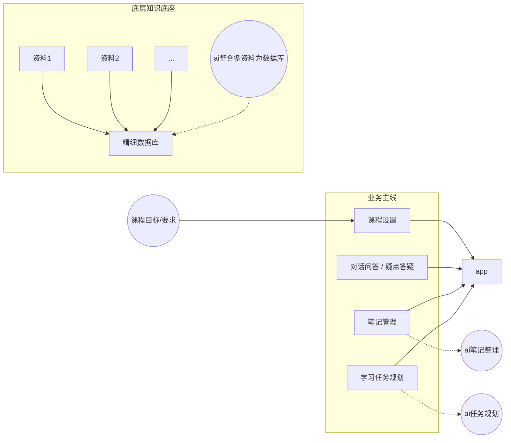
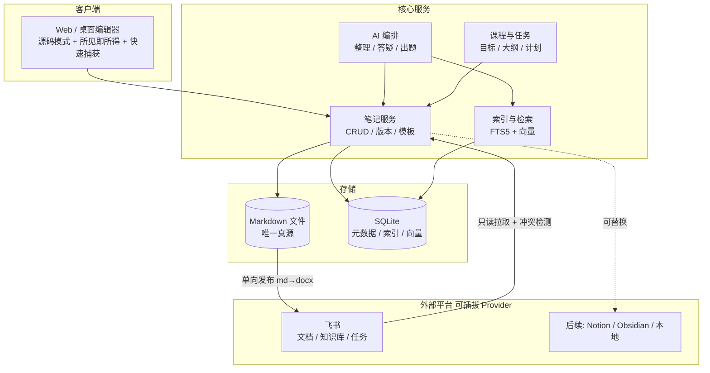

# AI 辅助学习 App · 可行性分析与功能扩展规划

> 输入来源：`E:\Docs\新建文件夹\ai辅助学习.drawio`（需求草图，下方已还原）
> 样本平台：**飞书 / Lark**（作为第一个被集成、也是第一个被对标的平台）
> 起点功能：**Markdown 笔记的记录与管理模式**
> 文档版本：v1.0 · 结论先行，证据在后

> **📌 v1.1 修订说明（重要）**
> 本文档的需求已细化为"**融合 `E:\Agents` 下三个已有 Agent（`python-tutor` / `java-mentor` / `feishu-notes`）、以代码学习为初级目标、解决自主学习五无问题**"的完整系统。
> 系统设计以 **`AI辅助学习-App-系统设计（融合版）.md`** 为准，本文档以下结论仍然有效：
> - ✅ 飞书能力的核验结果（§2）与"导出不支持 Markdown"这一核心约束
> - ✅ 风险清单（§3.4）与目标架构（§4）
> - ✅ 扩展功能清单（§5）——作为长期功能池
> - ⚠️ **§6 的分期路线已被取代**：原 P0"只做 Markdown 笔记、不做 AI" 的范围，已被融合版 §15 的 P0"单课掌握闭环"取代（笔记模式降级为闭环中的一个环节，而非独立起点）

---

## 0. 一句话结论

**可行，但必须把"飞书"从"存储后端"降级为"分发与协作出口"。**

原因是一个已经核实过的硬约束：飞书云文档的**导出任务不支持 Markdown**（只支持 docx / pdf / xlsx / csv），而导入是支持的。这意味着：

- `本地 Markdown → 飞书文档` ✅ 单向可行（导入任务、或 Markdown 转块 + 批量插入）
- `飞书文档 → 本地 Markdown` ⚠️ 官方无接口，只能自己读 blocks 再渲染回 MD，且表格/图片/画板/多维表格等块类型**信息必然有损**

**因此架构结论：本地 Markdown 是唯一真源（Single Source of Truth），飞书是只读镜像 + 协作出口。** 这条结论决定了后面所有分期和扩展功能的取舍。

---

## 1. 需求还原：草图里到底画了什么

从 drawio 的 21 个节点还原出的结构（`app` 为中心，四条业务主线挂在其上）：



**草图的真实意图**（我的解读）：

| 草图元素 | 意图 |
| --- | --- |
| `资料1/2/...` → `精细数据库` | 用户扔进一堆原始资料（PDF / 网页 / 课件 / 录音），AI 把它们**结构化**成可检索的细粒度知识库，而不是简单堆文件 |
| `精细数据库` | 关键词是"精细"——不是全文库，而是**分块 + 概念 + 关系**级别的库。这是整个 App 的技术护城河 |
| `ai笔记整理` | 把粗糙的记录（课上速记、截图、语音）自动整理成有结构、有层级的笔记 |
| `对话问答/疑点答疑` | 基于**自己的资料 + 自己的笔记**做 RAG 问答，不是通用聊天机器人 |
| `课程设置` ← `课程目标/要求` | 以"课程目标"为锚组织一切：资料、笔记、任务都挂在课程目标下 |
| `学习任务规划` | 从课程目标 / 大纲 / 笔记待办推导出**可执行的学习计划**，而不是一个孤立的待办列表 |

**与飞书的关系**：飞书文档 / 知识库 / 多维表格 / 妙记 / 任务 / aily 已经覆盖了上面**大部分单点能力**。所以这个 App 的立项前提不是"做个更好的笔记工具"，而是：

> 飞书把资料**存**得很好，但不会**替你学**。本 App 的价值在于把「资料 → 笔记 → 答疑 → 习题 → 复习计划」串成一个**以课程目标为约束的闭环**。

如果做不出这个闭环，产品就没有存在必要——这是可行性分析里最需要先回答的问题。

---

## 2. 飞书作为样本平台：能力核验（已逐条查证官方文档）

### 2.1 能做笔记管理的飞书能力

| 能力 | 接口 / 位置 | 关键限制 | 对我们的意义 |
| --- | --- | --- | --- |
| Markdown → 飞书文档（**推荐**） | `POST /open-apis/docx/v1/documents/blocks/convert` 转块，再 `POST .../blocks/{block_id}/descendant` 插入 | 单次插入 **≤1000 块**；文本上限 **10 MB**；表格块需先删只读字段 `merge_info`；图片需二次上传素材 + `replace_image` | 主力写入通道，支持标题/列表/代码/引用/待办/表格/公式（KaTeX） |
| Markdown 文件 → 飞书文档 | `POST /open-apis/drive/v1/import_tasks` | 需先上传文件拿 `file_token`；**上传文件 5 分钟过期**；**≤20 MB**；100 次/分钟；扩展名必须严格一致（`md` / `markdown` / `mark` 不能混） | 适合"整篇笔记发布"，比逐块插入省调用 |
| **导出为 Markdown** | `POST /open-apis/drive/v1/export_tasks` | ❌ **不支持 md**，只有 `docx/pdf/xlsx/csv` | **核心约束**：反向同步必须自研 |
| 读文档全部块 | `GET /open-apis/docx/v1/documents/{id}/blocks` | 500 块/页；**单应用 ~5 QPS**，超限 99991400 | 反向同步 / 差异比对的数据源，注意限频 |
| 知识库（目录树） | `POST /open-apis/wiki/v2/spaces/{space_id}/nodes`、`GET .../nodes` | 单空间 ≤40 万节点、≤50 层、单父节点 ≤2000 子节点；应用需为知识库成员 | 用飞书知识库当"课程目录树"的外部镜像 |
| 全文搜索 | `POST /open-apis/search/v2/doc_wiki/search` | `query` ≤30 字符；`page_size` ≤20；需 user_access_token；必须搭配 doc_filter / wiki_filter | **不能当自己的检索后端**（太受限），只能做"顺便搜飞书" |
| 结构化数据 | 多维表格 bitable API | - | 适合放"题库 / 错题本 / 概念卡"这类表格化数据 |

### 2.2 关键结论

1. **写入通道成熟，读取通道半残。** 发布到飞书很容易；从飞书取回 Markdown 要自己写 `blocks → MD` 渲染器，而且画板、思维笔记、多维表格、AI 模板块等**注定无法还原**。
2. **飞书搜索不能替代本地检索。** 30 字 query、20 条分页、强制带 filter，做不了"全库语义检索"。
3. **API 全是免费额度 + 限频模式。** 成本不在飞书，在 LLM。
4. **平台风险真实存在**：旧版文档创建能力已经下线过一次（错误码 131010）。把核心数据放在只有单向导出能力的平台上，是有锁定风险的——这再次支持"本地 MD 为真源"。

---

## 3. 可行性分析

### 3.1 技术可行性：逐模块打分

| 模块 | 难度 | 可行性 | 说明 |
| --- | --- | --- | --- |
| Markdown 记录与编辑 | ★★☆ | ✅ 高 | CodeMirror 6 / Vditor / Milkdown 成熟；渲染用 markdown-it + highlight.js + KaTeX + Mermaid 即可 |
| 笔记管理（目录/标签/检索/双链） | ★★☆ | ✅ 高 | 文件系统 + SQLite FTS5 即可；双链靠解析 `[[...]]` 建反向索引 |
| 资料 → 精细数据库 | ★★★★ | ⚠️ 中 | **全项目最大瓶颈**。PDF 文字层/扫描件 OCR、PPT、视频字幕、网页正文抽取，全是脏活；分块策略直接决定问答质量 |
| AI 笔记整理 | ★★★ | ✅ 中高 | 本质是"结构化重写 + 抽取"，LLM 已能做好；难点是**不要让 AI 污染原始记录**（用 diff 建议 + 人工接受） |
| RAG 答疑 | ★★★ | ✅ 中高 | 分块 + 向量检索 + 引用溯源，工程上已标准化；难在**答案可信度**（必须能点回原文段落） |
| 课程设置 / 任务规划 | ★★☆ | ✅ 高 | 数据结构 + 规则 + LLM 提示词；可同步飞书任务 |
| 飞书双向同步 | ★★★★ | ⚠️ 中低 | 上述导出限制 + 5 QPS + 块模型差异，**建议只做单向** |
| 多端（桌面/移动/小程序） | ★★★★ | ⚠️ 中 | 后期再说，先 Web |

### 3.2 数据可行性

```
原始资料 ──解析──> 纯文本 + 结构 ──分块──> chunk ──抽取──> 概念/关系/习题 ──> 精细数据库
   ↑ 质量损失的 80% 在这一步
```

- **教材/PDF**：有文字层的直接抽；扫描件要 OCR（错误率直接影响下游一切）
- **视频/课堂录音**：需 ASR（飞书妙记可作样本，本地可用 whisper）
- **网页**：已高度模板化，用 readability 类方案
- **自有笔记**：质量最高、最该被优先索引

> 建议：**Phase 1 只索引用户自己的 Markdown 笔记 + 手动粘贴的文本**。等到笔记模式跑通、有真实使用数据后，再引入重型文档解析。上来就啃 PDF 是常见的项目死亡路径。

### 3.3 成本可行性

| 项 | 估算 | 备注 |
| --- | --- | --- |
| 飞书开放平台 | 0 元 | 自建应用免费，限制在调用频率与权限 |
| LLM（笔记整理） | 每万字笔记约 1 次结构化调用 | 这是主要成本项；建议本地/廉价模型做初稿，强模型做难点 |
| 向量检索 | pgvector / SQLite `sqlite-vec` / LanceDB 均可本地零成本 | 单机笔记量（<10 万 chunk）完全够用 |
| 服务器 | 单人自用可纯本地（Electron/本地 Web） | 多人协作才需要服务器 |

### 3.4 主要风险

| 风险 | 等级 | 缓解 |
| --- | --- | --- |
| 与飞书功能重叠、差异化不足 | 🔴 高 | 死守"课程目标 → 笔记 → 答疑 → 复习"闭环，不做通用文档工具 |
| 资料解析质量差，导致 RAG 幻觉 | 🔴 高 | 答案必须带原文引用与跳转；无引用不回答 |
| 飞书平台锁定 / API 变更 | 🟡 中 | 本地 MD 真源；飞书适配层做成可替换的 Provider 接口 |
| 版权与隐私（上传教材、笔记上云） | 🟡 中 | 默认纯本地；上云为显式开关，按课程/笔记本粒度控制 |
| 范围膨胀（想啥都做） | 🔴 高 | 严守分期路线，P0 只做笔记，其余全部延后 |
| 单人维护成本 | 🟡 中 | 零依赖/少依赖技术栈优先（现有 `book` 项目就是纯 JDK 路线） |

---

## 4. 目标架构（含飞书的正确位置）



**要点**：`Provider` 是一层接口，飞书只是第一个实现。这样"先以飞书为样本"才不变成"被飞书绑死"。

---

## 5. 扩展功能清单（对照草图四条主线）

### 5.1 笔记管理（起点）

| 编号 | 功能 | 分期 |
| --- | --- | --- |
| N1 | Markdown 编辑器：源码 / 分屏预览 / 所见即所得，落盘恒为 md | P0 |
| N2 | 目录树（课程 → 章节）+ 模板（康奈尔、概念卡、课堂速记） | P0 |
| N3 | 标签体系 + 全文检索（中文分词） | P0 |
| N4 | 数学公式 KaTeX / 代码高亮 / Mermaid 图表 | P0 |
| N5 | 双链 `[[...]]` + 反向链接面板 + 块引用 `^id` | P1 |
| N6 | AI 整理：速记 → 结构化、术语表、待办抽取（**以 diff 建议形式**） | P1 |
| N7 | 版本历史 / 快照 / 回收站 | P1 |
| N8 | 待办解析 `- [ ]` → 学习任务 | P1 |
| N9 | 导出：MD / PDF / 飞书文档 / Anki | P1 |
| N10 | 图片与附件管理（本地附件目录 + 粘贴上传） | P1 |
| N11 | 飞书知识库镜像发布（单向） | P1 |
| N12 | 编辑历史 / 学习时长统计 | P2 |

### 5.2 对话问答 / 疑点答疑（Q）

| 编号 | 功能 | 分期 |
| --- | --- | --- |
| Q1 | 基于"当前笔记"的问答（上下文 = 打开的笔记） | P1 |
| Q2 | 基于"整门课程资料 + 笔记"的 RAG 问答，**强制引用溯源** | P2 |
| Q3 | 疑点本：把一次答疑固化成"问题 / 答案 / 出处 / 状态" | P2 |
| Q4 | 答疑结论一键回写笔记（生成"答疑记录"小节） | P2 |
| Q5 | 追问链与对话分支；对同一概念的多次提问自动聚合 | P3 |
| Q6 | 苏格拉底式引导模式（不给答案，给步骤提示） | P3 |

### 5.3 精细数据库（底层，对应"ai整合多资料为数据库"）

| 编号 | 功能 | 分期 |
| --- | --- | --- |
| D1 | 资料接入：粘贴文本 / 导入 md / txt | P1 |
| D2 | 资料接入：PDF（文字层）、网页、PPT、视频字幕 / ASR | P2 |
| D3 | 智能分块（按标题层级 + 语义边界）+ 每块可回溯原文 | P2 |
| D4 | 概念卡自动抽取：定义 / 公式 / 例题 / 易错点 / 前置知识 | P2 |
| D5 | 概念关系图（前置 → 后续、相似、对比），可视化 | P3 |
| D6 | 题库：从资料与笔记生成选择/填空/简答，人工审核后入库 | P2 |
| D7 | 间隔复习（FSRS / SM-2）+ 每日复习队列 | P2 |
| D8 | 多维表格同步（题库 / 错题本放飞书多维表格） | P3 |

### 5.4 课程设置（C，锚点模块）

| 编号 | 功能 | 分期 |
| --- | --- | --- |
| C1 | 课程对象：目标、周期、考核要求、资料清单 | P1 |
| C2 | 大纲 / 章节树（作为笔记目录的骨架） | P1 |
| C3 | 目标达成度看板（哪些目标已被笔记/习题覆盖） | P2 |
| C4 | 目标 → 资料 → 笔记 → 习题 的可追溯链 | P2 |
| C5 | 多课程并行与周视图 | P2 |

### 5.5 学习任务规划（T）

| 编号 | 功能 | 分期 |
| --- | --- | --- |
| T1 | 笔记待办聚合为任务收件箱 | P1 |
| T2 | 按课程目标 + 剩余时间自动生成周计划 | P2 |
| T3 | 复习任务由遗忘曲线自动排期 | P2 |
| T4 | 同步飞书任务（task v2 API），双向状态 | P2 |
| T5 | 每日 / 每周回顾报告（学了什么、卡在哪、下一步） | P2 |
| T6 | 番茄钟 / 专注记录，回填学习时长 | P3 |

### 5.6 横向扩展

- **多端**：Web → 桌面（Tauri/Electron）→ 移动端 / 飞书小程序
- **协作**：共享课程、笔记互评、多人共编（需 CRDT，成本高，最后做）
- **妙记集成**：课堂录音 → 转写 → AI 整理成笔记草稿
- **AI 出题与自测**：错题驱动复习，而非题海
- **开放能力**：本地 HTTP API / MCP，让 DSH、编辑器插件、脚本都能读写笔记

---

## 6. 分期路线与验收标准

| 阶段 | 周期（单人估算） | 交付 | 验收标准 |
| --- | --- | --- | --- |
| **P0 笔记内核** | 2–3 周 | 笔记 CRUD、目录树、标签、全文检索、Markdown 渲染（公式/代码/Mermaid）、模板 | 能连续 7 天真实记录课程笔记而不想退回飞书文档 |
| **P1 AI 整理 + 双链 + 飞书发布** | 3–4 周 | AI 结构化整理（diff 建议）、双链与反链、待办抽取、导出 MD、飞书单向发布 | 一篇 2000 字杂乱速记 → 30 秒内得到结构化笔记；发布到飞书知识库成功且格式无明显丢失 |
| **P2 精细数据库 + RAG 答疑 + 复习** | 4–6 周 | PDF/网页/字幕接入、分块与引用、概念卡、RAG 问答、题库、FSRS 复习 | 任意提问都能给出**可点击回溯到原文**的答案；复习队列每日自动生成 |
| **P3 规划闭环 + 多端** | 持续 | 目标达成度看板、飞书任务双向、日报周报、桌面/移动端 | 打开 App 就知道"今天该学什么"，且能追溯到课程目标 |

**P0 的取舍**：不做 AI、不做同步、不做数据库解析。只回答一个问题——**"这个 Markdown 笔记工具，我用得下去吗？"**

---

## 7. 技术选型建议

现有工作区 `E:\Docs\Code\Java\book` 是**纯 JDK 21 + `com.sun.net.httpserver` + JSON 文件持久化、零第三方依赖**的 Web 应用。两条路线：

| 方案 | 优点 | 缺点 | 适用 |
| --- | --- | --- | --- |
| **A. 沿用 Java 零依赖栈** | 与现有项目一致、构建即 `javac`、无供应链风险、部署为零 | 无 Markdown 库（渲染必须放前端）、无向量检索、AI 生态弱 | **P0 原型**强烈推荐 |
| **B. Java + SQLite (FTS5) + 前端 markdown-it** | 检索强、结构清晰、仍可无框架 | 需引入 JDBC 驱动，破坏"零依赖" | P1–P2 |
| **C. 换 Node/TypeScript 或 Python 后端** | Markdown / RAG / LLM 生态最好，Yjs 等现成 | 与现有项目割裂，需重搭脚手架 | 若确定要做 RAG 与多端 |

**我的建议**：**P0 用方案 A 在 `book` 同款风格下起一个新项目**（如 `E:\Docs\Code\Java\study`），验证交互形态；P2 引入向量检索时再决定是否迁移。关键在于**先把笔记模式打磨到真好用**，而不是先选一个"未来正确"的重栈。

飞书适配层的接口设计（与语言无关）：

```
Provider
  publish(noteMarkdown) -> { nodeToken, url }      // md → 飞书文档
  fetch(nodeToken)       -> { markdown, etag }     // 读 blocks → md（有损，仅用于冲突检测）
  syncTasks(tasks)       -> void
  search(query)          -> Result[]               // 受限，仅作补充
```

---

## 8. 下一步（Phase 1 起点）

**立即要做的事**：把「Markdown 笔记记录与管理模式」做成可运行的 P0。

详细设计见同目录 `Phase1-Markdown笔记模式-设计.md`，其中包含：
- 笔记文件格式与 YAML frontmatter 规范
- 目录 / 标签 / 双链 / 模板的数据模型
- 本地 API 设计（REST + 静态前端）
- AI 整理流水线的输入输出契约（含"建议式 diff"）
- 飞书单向发布的调用序列与失败重试
- P0 验收清单

---

## 附录 A：飞书 API 速查（已核验）

| 用途 | 方法与路径 | 频率 | 主要限制 |
| --- | --- | --- | --- |
| Markdown → 块 | `POST /open-apis/docx/v1/documents/blocks/convert` | - | 内容 ≤10 MB；支持文本/1–9 级标题/列表/代码/引用/待办/图片/表格/公式 |
| 批量插入块 | `POST /open-apis/docx/v1/documents/{doc}/blocks/{block}/descendant` | - | 单次 ≤1000 块；表格需删 `merge_info`；图片需二次上传 + `replace_image` |
| 导入文件 | `POST /open-apis/drive/v1/import_tasks` | 100/分 | 源文件 ≤20 MB；上传 token 5 分钟过期；扩展名须严格一致 |
| 导出文件 | `POST /open-apis/drive/v1/export_tasks` | 100/分 | **不支持 markdown**（仅 docx/pdf/xlsx/csv） |
| 读文档块 | `GET /open-apis/docx/v1/documents/{doc}/blocks` | 500 块/页 | 应用级 **5 QPS**（99991400） |
| 创建知识库节点 | `POST /open-apis/wiki/v2/spaces/{space_id}/nodes` | 100/分 | 空间 ≤40 万节点、≤50 层、单层 ≤2000 |
| 列知识库子节点 | `GET /open-apis/wiki/v2/spaces/{space_id}/nodes` | 100/分 | `page_size` ≤50 |
| 文档搜索 | `POST /open-apis/search/v2/doc_wiki/search` | 100/分 | query ≤30 字；`page_size` ≤20；需 user_access_token |

## 附录 B：参考文档

- [创建导入任务](https://open.feishu.cn/document/server-docs/docs/drive-v1/import_task/create.md)
- [创建导出任务](https://open.feishu.cn/document/server-docs/docs/drive-v1/export_task/create.md)
- [Markdown/HTML 内容转换为文档块](https://open.feishu.cn/document/ukTMukTMukTM/uUDN04SN0QjL1QDN/document-docx/docx-v1/document/convert.md)
- [获取文档所有块](https://open.feishu.cn/document/server-docs/docs/docs/docx-v1/document/list.md)
- [创建知识空间节点](https://open.feishu.cn/document/server-docs/docs/wiki-v2/space-node/create.md) · [获取子节点列表](https://open.feishu.cn/document/server-docs/docs/wiki-v2/space-node/list.md)
- [文档搜索](https://open.feishu.cn/document/uAjLw4CM/ukTMukTMukTM/search-v2/doc_wiki/search.md)
