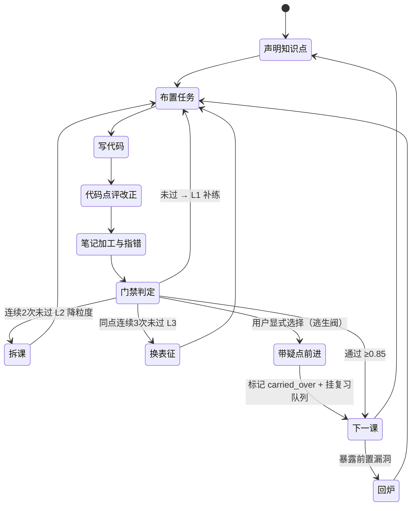

# AI 辅助学习 App · 可行性深化分析（S4 定案版）

> 关联目标：`goal-c45413f5-6200-451a-a4b4-03a15d6f4f5a`
> 上游文档：`AI辅助学习-App-系统设计（融合版）.md`
> 本轮任务：**S4 按既定思路定案** + 面向"新增四块"的可行性深化 + 成本与工作量核算
> 数据来源：DeepSeek 官方价目（实时查证）、`E:\Agents` 三个 Agent 源码、飞书开放平台文档

---

## 1. 本轮结论摘要

| # | 结论 | 影响 |
| --- | --- | --- |
| 1 | **S4 定案**，10 项决策冻结（含"硬门禁 + 逃生阀"），见 §2 | 可以进入实现 |
| 2 | **成本不是约束**：整条 Python 路线（9 课）≈ **2–3 元**，见 §5 | 不必为省钱牺牲质量；可放心多次判分、多轮点评 |
| 3 | ⭐ **重大简化**：`deepseek-flash` 是 **1M 上下文**，缓存命中输入仅 **0.02 元/百万**。课程级资料（≤20 万字）**可以全量塞进上下文**，因此 **P0/P1 完全不需要向量库** | "精细数据库"从"检索基础设施"降级为"结构化记账 + 出处锚点"，砍掉一整块复杂度 |
| 4 | ⭐ **依赖可合并**：`deepseek-flash` **已支持图像理解**，而 `deepseek-v4-pro` 不支持。现有 `feishu-notes` 走 SiliconFlow + PaddleOCR-VL 的独立视觉链路**可以收掉** | 少一个模型供应商、少一个 API Key、少一处故障点 |
| 5 | **真正的可行性风险是三个技术假设（H1/H2/H3）**，不是工程难度 | 必须先做 spike 验证，再投入主体开发，见 §4 |

---

## 2. S4 定案：决策冻结清单

| # | 决策 | 内容 | 状态 |
| --- | --- | --- | --- |
| D1 | 四维加权 | `mastery = 0.35·code + 0.25·quiz + 0.20·note + 0.20·transfer` | ✅ 冻结 |
| D2 | 门禁条件 | `mastery ≥ 0.85` 且 `min(四维) ≥ 0.6` 且 无 fatal 且 必会知识点覆盖 100% | ✅ 冻结 |
| D3 | **逃生阀** | 未通过时提供显式「带疑点前进」：需用户手动确认 → 知识点标记 `carried_over` → 强制挂复习队列 → **下一课开头重新考核** | ✅ **已采纳**（用户本轮确认） |
| D4 | 未过三级处理 | L1 补练（单维 0.6–0.85）→ L2 降粒度（连续 2 次未过）→ L3 换表征（同一知识点连续 3 次未过） | ✅ 冻结 |
| D5 | 回炉机制 | 后续课程 `findings.knowledge_gaps` 命中已通过的前置原子 → 该原子 mastery ×0.7 并重回复习队列 | ✅ 冻结 |
| D6 | 点评结构化 | 每次点评落盘 `findings.json`（含 `knowledge_gaps`），直接写入掌握度模型 | ✅ 冻结 |
| D7 | 笔记五维体检 | 结构 / 覆盖 / 准确 / 关联 / 自产；**纠错必须引用 `source.ref`，无依据只能标"待确认"** | ✅ 冻结 |
| D8 | AI 只出建议 | 所有 AI 产出为 diff 建议，用户逐条接受 / 忽略 / 编辑后接受 | ✅ 冻结 |
| D9 | 引导不代写 | 除非用户明确要答案，只给提示 | ✅ 冻结 |
| D10 | 笔记门槛 | 只卡"必会知识点覆盖 100% + 无事实错误"，**不卡文采与篇幅** | ✅ 冻结 |

**定案后的 S4 状态机**（含逃生阀分支）：

---

## 3. 新增四块的可行性再评估

（"教与评"部分已有 `tutor.py` / `mentor.py` 成熟实现，可复用 75–85%，此处只评新增部分。）

### 3.1 学习库：知识原子抽取

| 项 | 判断 |
| --- | --- |
| 难度 | ★★★☆ |
| 可行度 | ⚠️ **中** — 取决于假设 H1（§4.1） |
| 最小可行实现 | 不建向量库、不做 PDF 解析。**先只用两类资料：① 你自己已有的 Markdown 笔记 ② 飞书文档（`feishu-notes` 已能读）**。让 LLM 按 atom schema 输出 JSONL，**人工批量确认**后入库 |
| 失败模式 | 抽出"正确但无用"的原子（如把整段抄成一条 atom）；出处错位；颗粒度失控 |
| 判定标准 | 50 条抽样中，**"可检验"且"出处正确" ≥ 45 条** |

**关键简化（来自 §1 结论 3）**：由于上下文足够大，**原子的首要用途不是"检索"，而是"记账与锚点"**——记录"这个知识点你掌没掌握"、点评时指向"这个错属于哪个原子"、体检时指向"这个结论出自哪里"。这比"用它做 RAG 检索"要求低得多，可行性显著上升。

### 3.2 知识点 DAG（体系图）

| 项 | 判断 |
| --- | --- |
| 难度 | ★★☆ |
| 可行度 | ✅ **高** — 纯数据结构 + 渲染，无 AI 依赖 |
| 最小可行实现 | 三种边（`prerequisites` / `contrast` / `applies_to`）先用 **LLM 生成草图 + 人工确认**，不用全自动。渲染用 Mermaid（零依赖）即可，先不做交互图 |
| 失败模式 | 边过多导致图变成毛线球（每个点都"相关"等于没有体系） |
| 判定标准 | 单课程节点 ≤ 40 个，`prerequisites` 边平均出度 ≤ 2；用户能看着图说出"我卡在哪一环" |

**强约束建议**：`contrast` 与 `applies_to` 是**弱边**，默认不显示，只在讲某个知识点时局部展开。否则体系图失去可读性。

### 3.3 笔记医生（五维体检）

| 项 | 判断 |
| --- | --- |
| 难度 | ★★★ |
| 可行度 | ⚠️ **中** — 取决于假设 H3（§4.3） |
| 最小可行实现 | **先只做两维：② 覆盖（纯集合运算，无 AI 幻觉风险）+ ③ 准确（强制带出处）**。结构/关联/自产三维后置 |
| 失败模式 | **假阳性纠错**——AI 把一个正确的说法标成错误。这是**最伤信任**的失败：用户一次被误纠，就再也不信体检报告 |
| 判定标准 | 抽样 20 条纠错，**假阳性 ≤ 1 条**（precision ≥ 95%）；覆盖维度的判定必须与 `knowledge[]` 精确对齐，不允许"大概提过就算" |

**实现要点**：覆盖维度用**程序判定**（关键词/原子名匹配 + 人工可校正的同义词表），不交给 LLM 自由心证——把最容易被信任的部分做成确定性的。

### 3.4 掌握度门禁

| 项 | 判断 |
| --- | --- |
| 难度 | ★★☆（评分公式简单） |
| 可行度 | ⚠️ **中** — 难点全在假设 H2（§4.2，判分一致性） |
| 最小可行实现 | **不用 LLM 自由打分，改用结构化 rubric 逐项判定**：`self_check` 每题拆成 2–3 个判定点，每个点输出 `{判定: 通过/部分/未通过, 依据}`，再按 0/0.5/1 折算。`temperature=0` |
| 失败模式 | 同一份答案两次判定不一致 → 门禁变成抽奖 → 用户失去公平感 → 弃用 |
| 判定标准 | 同一份答案判 3 次，`mastery` 极差 **≤ 0.05**；落在阈值 ±0.05 区间时**强制二次判定 + 提示人工复核** |

**这是整个系统里最需要工程严谨的一环**：门禁必须让人服气。宁可判得保守，也不能判得随机。

### 3.5 多语言 Runner / 执行安全

| 项 | 判断 |
| --- | --- |
| 难度 | ★★☆ |
| 可行度 | ✅ **高** — 两个 Agent 已分别实现 Python 与 Java 单文件运行 |
| 最小可行实现 | 复用白名单前缀 + 超时强杀（`tutor.py:191` 已有）；扩到 `python` / `java` 两个 runner |
| 失败模式 | 用户代码死循环 / 无限输出 / 磁盘写爆 |
| 判定标准 | 超时 20s 强杀、stdout 截断（建议 8 KB）、只允许 workspace 内路径；**不允许 shell 任意命令** |

**注意**：这是"运行用户自己写的代码"，**不是沙箱**。默认本地单人使用可接受；若将来多人/服务化，必须换成容器隔离——**这一条要写进架构约束，不要留幻想**。

### 3.6 编排与状态持久化

| 项 | 判断 |
| --- | --- |
| 难度 | ★★☆ |
| 可行度 | ✅ **高** |
| 最小可行实现 | 角色间只通过 **JSON 文件**通信（沿用现有 `progress.json` / `history.json` 风格），不引入消息队列/数据库 |
| 失败模式 | 状态文件与 Markdown 真源不一致 |
| 判定标准 | **所有 JSON 可删除重建**（沿用已定原则）；任何时刻中断，重启能恢复到最后一次落盘状态 |

---

## 4. 三个关键可行性假设（真正的风险所在）

> 工程难度都不高。**真正决定这个项目成败的，是下面三个"AI 到底靠不靠谱"的假设。**
> 建议在写任何主体代码之前，先花 3–5 天做这三个 spike。

### 4.1 H1：LLM 能可靠地抽出"带出处、可检验"的知识原子

| 项 | 内容 |
| --- | --- |
| 假设 | 给定一段资料，模型能抽出既有信息量、又**能在原文定位**的最小知识单元 |
| 验证方法 | 取现有第 3 课（网络爬虫）的真实资料，跑 1 次抽取，**人工逐条核对 50 个原子** |
| 通过标准 | "可检验" ≥ 45/50 且 "`source.ref` 定位正确" ≥ 45/50 |
| 不通过时降级 | ① 降低自动化：改为**模型只标注候选句，人工确认成原子**；② 把原子来源限定为"你自己的笔记"（质量最高、你天然能判断对错） |
| 工期 | 1–2 天 |

### 4.2 H2：判分具备一致性（**最高风险**）

| 项 | 内容 |
| --- | --- |
| 假设 | 同一份用户答案，多次判定能得到稳定结论，门禁具备"公平性" |
| 验证方法 | 手工准备 5 份答案（明确通过的 2 份、明确不通过的 2 份、**边界 1 份**），每份判 3 次，记录 `mastery` 方差 |
| 通过标准 | 极差 ≤ 0.05；且"明确通过/不通过"的 4 份判定 100% 正确（不出现把及格判成不及格） |
| 不通过时降级 | ① 把 `quiz` 维度改为**结构化判定点**（§3.4）而非自由打分；② 阈值判定改为**多次取中位数 + 边界人工复核**；③ 极端情况：门禁只作为**建议**，最终以用户自评确认 |
| 工期 | 1–2 天 |

**为什么这是最高风险**：门禁不公平 = 系统的核心承诺破产。而"AI 打分"恰恰是最容易看起来合理、实际随机的一环（同一段回答换次调用就换个分数）。**必须实测，不能想当然。**

> ### ✅ 实测结果（2026-09-16）：**PASS**
> 脚本：`spikes/s_h2_judge_consistency.py` · 结果：`spikes/results/s_h2_20260916-102849.json`
>
> | 答案 | 预期 | 3 次得分 | 均值 | 极差 |
> | --- | --- | --- | --- | --- |
> | A1 完整（GIL+CPU/IO+C++对照） | pass | `[1.0, 1.0, 1.0]` | 1.0 | **0.0** |
> | A2 正确但简短 | pass | `[0.833, 0.833, 0.833]` | 0.833 | **0.0** |
> | A3 边界（忽略 IO 场景） | fail | `[0.167, 0.167, 0.167]` | 0.167 | **0.0** |
> | A4 概念错误（GIL＝Lock 可手动关） | fail | `[0.0, 0.0, 0.0]` | 0.0 | **0.0** |
> | A5 浅表（"解释型所以慢"） | fail | `[0.0, 0.0, 0.0]` | 0.0 | **0.0** |
>
> - **指标 1**：极差 ≤ 0.05 → **5/5 通过**（实际全为 0.0，完全一致）
> - **指标 2**：明确标注答案分类正确 → **5/5**
> - 边界答案 A3 落在 0.167（远低于 0.6 门限），**没有出现"及格判成不及格"或反之**
> - 成本：15 次判定共 **0.0123 元**（输入未命中 3289 / 命中 2048 / 输出 2229 tokens）
>
> **结论**：结构化 rubric + `thinking=disabled` + `temperature=0` 的判分方案成立，门禁可以放心实现。
> **但注意成立条件**：一致性**依赖于关闭思考模式**（见 §6 适配点 6）——思考模式会忽略 `temperature`，那样这套方案不成立。

### 4.3 H3：笔记纠错不产生假阳性

| 项 | 内容 |
| --- | --- |
| 假设 | 模型指出的"错误"确实是错误 |
| 验证方法 | 取用户已有的 3–5 篇真实笔记，跑体检，**人工核对每一条纠错** |
| 通过标准 | 假阳性 ≤ 5%（20 条里最多 1 条错纠） |
| 不通过时降级 | ① `准确` 维度只保留**能引用原文出处**的纠错，其余全部降级为"待确认"（已在 D7 冻结，此处是兜底执行力度）；② 报告改为"建议你自己核对这几点"的**提问式**而非断言式 |
| 工期 | 1 天 |

> ### ✅ 实测结果（2026-09-16）：**PASS**
> 脚本：`spikes/s_h3_note_doctor.py` · 结果：`spikes/results/s_h3_20260916-102952.json`
>
> **方法**：构造一篇学生笔记，**植入 5 个已知错误**（其中 4 个在学习库资料中有依据、1 个**故意不让资料覆盖**）+ **5 句正确表述**，让笔记医生原型对照资料体检，人工逐条比对。跑了 3 次。
>
> | 指标 | 3 次结果 | 标准 | 判定 |
> | --- | --- | --- | --- |
> | precision（报出的 error 里真错的比例） | `1.00 / 1.00 / 1.00` | ≥ 0.95 | ✅ |
> | recall（4 个有依据的植入错误被抓出） | `1.00 / 1.00 / 1.00` | — | ✅ |
> | **把正确句误报为 error 的条数** | `0 / 0 / 0` | = 0 | ✅ |
> | 资料未覆盖的错误是否降级 | `True / True / True` | 必须降级 | ✅ |
> | 覆盖维度（应指出 robots.txt 缺失） | 3 次全部正确 | — | ✅ |
>
> **关键观察**：
> - 4 条被断言的错误**全部带上了正确的 `source_ref`（M4 / M2 / M3 / M5）**——"必须引依据"的约束被真实执行了。
> - 资料未覆盖的 `timeout 默认 30 秒` 被标为 **`uncertain` 且 `source_ref` 留空**——**"无依据不下结论"这条红线成立**，这是笔记医生不伤信任的关键。
> - 3 次输出**逐字一致**（不只是分数一致），说明该任务在 `thinking=disabled + temperature=0` 下完全确定。
> - 成本：3 次体格体检 ≈ **0.0069 元**（含缓存命中）。
>
> **结论**：笔记医生的"准确"与"覆盖"两维方案成立，可以进入实现。
>
> ⚠️ **本测试的局限（不要过度外推）**：错误是**人工植入**的、资料是**精选**的、正确句是**明确无误**的。真实笔记更脏（口语化、半对半错、跨知识点混杂）。**上线后需持续抽样统计 precision**，建议先只对"必会知识点"启用硬性纠错。

---

## 5. 成本模型（基于 DeepSeek 官方实时价目）

### 5.1 官方价目（每百万 tokens，人民币）

| 模型 | 输入·缓存命中 | 输入·未命中 | 输出 | 上下文 | 图像理解 |
| --- | --- | --- | --- | --- | --- |
| **`deepseek-flash`** | 空闲 0.02 / 高峰 0.04 | 空闲 1 / 高峰 2 | 空闲 4 / 高峰 8 | **1M** | ✅ 支持 |
| `deepseek-v4-pro` | 空闲 0.15 / 高峰 0.30 | 空闲 4.5 / 高峰 9 | 空闲 13.5 / 高峰 27 | 1M | ❌ 不支持 |

> 高峰时段 = 北京时间周一至周五 9:00–12:00、14:00–18:00；其余为空闲时段（半价）。
> 参考：[DeepSeek 模型 & 价格](https://api-docs.deepseek.com/zh-cn/quick_start/pricing)

### 5.2 单课成本分解（估算）

一次完整 S4 循环（布置任务 + 2 次代码点评 + 1 次笔记体检 + 门禁判定）约 **15 次模型调用**：

| 项 | 量 | 单价 | 小计 |
| --- | --- | --- | --- |
| 输入·缓存命中（system + 课程表 + 资料，稳定前缀） | ~180K | 0.02 元/M | 0.004 元 |
| 输入·未命中（用户代码、笔记、新资料） | ~45K | 1 元/M | 0.045 元 |
| 输出（点评、体检报告） | ~23K | 4 元/M | 0.090 元 |
| **单课合计** | | | **≈ 0.14 元** |

### 5.3 全局成本

| 场景 | 量 | 成本 |
| --- | --- | --- |
| 单课（含 3 次重判，冗余 ×3） | — | ≈ 0.4 元 |
| **整条 Python 路线（9 课）** | — | **≈ 1.3–3.6 元** |
| 学习库构建（50 万字资料抽取，含重试） | ~700K 输入 + 100K 输出 | ≈ 1.1 元 |
| **全部加起来** | | **≈ 2.5–5 元** |
| 每月（假设每周 3 课） | 12 课 | **< 2 元** |

**结论：成本不是约束。** 即使估算偏差 100 倍，也只是几百元级别。相比之下，飞书 API 免费但有限频、本地存储免费。**真正的成本是你的注意力，不是钱。**

**由此推出的设计自由**（很重要）：
- 可以放心**多次判分取一致**（H2 的降级方案，成本 ×3 也无所谓）
- 可以放心把**整个课程资料放进上下文**，不必做激进的分块检索
- 可以用 `deepseek-v4-pro` 只处理**难点**（如 H2 边界判定、体系图生成），其余走 flash——**模型路由**策略

### 5.4 成本优化手段（按性价比排序）

1. **保持 system prompt 稳定前缀**，吃满 0.02 元/M 的缓存命中价（现有 `build_system_prompt` 已把易变内容放在末尾，**这个结构要保留**）
2. 高峰时段（工作日白天）避免批量任务，闲时半价
3. 模型路由：flash 做主力，pro 只做判分复核与体系图
4. 输出长度控制：点评报告结构化输出比自由散文更省 token

---

## 6. 从现有代码中发现的 6 个必须修正的适配点

| # | 现状 | 问题 | 建议 |
| --- | --- | --- | --- |
| 1 | `config.json` 模型名为 **`deepseek-chat`** | ~~不在官方模型表内~~ → **已实测：仍可用（HTTP 200，正常返回）**，但属未文档化的历史别名，且**不具备** 1M 上下文 / 视觉 / 思考模式等新能力 | 不紧急。新功能按 `deepseek-flash` 设计，老链路暂不动 |
| 2 | `max_tokens: 1500`（tutor）/ `2000`（mentor） | 笔记体检报告 + 建议 diff + 逐行点评**远超此长度**，会被截断 | 提到 4000–8000，并区分"点评"与"体检"两档 |
| 3 | `FILE_READ_LIMIT = 6000` 字符 | 新流程要读**笔记 + 资料 + 多份练习**，6000 字符只够一个文件 | 提高，或改为"按角色分配预算 + 分段读取" |
| 4 | `TOOLS` 全部返回纯文本 | `findings.json` / `mastery.json` 要求**严格结构化**，靠模型自由输出 JSON 会不稳 | 使用官方 **[JSON Output](https://api-docs.deepseek.com/zh-cn/guides/json_mode)**（`response_format`）；**H2 spike 已验证可行（15/15 次解析成功）** |
| 5 | 视觉链路走 SiliconFlow + PaddleOCR-VL（独立 Key） | `deepseek-flash` 已支持图像理解 | 可合并为单供应商，**减少一个 Key 与故障点**；保留 SiliconFlow 作为降级选项 |
| 6 | ⚠️ **思考模式（新发现）** | `deepseek-flash` / `deepseek-v4-pro` **默认开启思考模式（effort=high）**，且：① **忽略 `temperature`**（设了不报错但不生效）；② 思维链**吃掉 ~75–79% 的输出预算**；③ 携带 `tools` 的请求必须完整回传 `reasoning_content`，否则 **400** | 学习类任务统一发 **`"thinking": {"type": "disabled"}`**（实测唯一有效的关闭写法；`enable_thinking` 会被忽略）。**判分场景必须关闭**，否则 §4.2 的一致性结论不成立 |

> 这 6 条都是**小改动、高收益**，适合放在 P0 开头一起做。

### 6.1 思考模式实测数据（`spikes/probe_thinking.py`）

| 用例 | 模型 | thinking | completion | reasoning | 正文 |
| --- | --- | --- | --- | --- | --- |
| A | `deepseek-chat` | — | 23 | — | 42 字 ✅ |
| B | `deepseek-flash` | 默认（开） | 117 | **91（78%）** | 43 字 |
| C | `deepseek-flash` | 默认（开） | 105 | **79（75%）** | 50 字 |
| D | `deepseek-flash` | **`{"type":"disabled"}`** | 23 | — | 42 字 ✅ |
| E | `deepseek-flash` | `enable_thinking:false` | 120 | **91（76%）** | 53 字 ❌ **无效写法** |
| F | `deepseek-v4-pro` | 默认（开） | 123 | **97（79%）** | 52 字 |

**含义**：若把现有 Agent 的 `max_tokens=1500` 直接切到 `deepseek-flash` 并保持默认思考模式，**实际可见输出只剩约 350 tokens**——逐行点评报告会被腰斩。这不是理论风险，是实测数字。

> 官方依据：[思考模式](https://api-docs.deepseek.com/zh-cn/guides/thinking_mode)（"思考模式默认打开，且 effort 默认为 high"；"思考模式不支持 temperature"）

---

## 7. 工作量估算（人天，单人）

| 阶段 | 模块 | 人天 | 复用度 |
| --- | --- | --- | --- |
| **P0 单课闭环** | 上述 5 个适配点修正 | 0.5 | — |
| | 知识点声明（`declares` + 知识卡输出） | 1 | 30% |
| | `findings.json` 结构化落盘（JSON Output） | 1.5 | 40% |
| | 笔记医生（先做覆盖 + 准确两维） | 2.5 | 30% |
| | 掌握度门禁（rubric 判定 + 一致性处理 + 逃生阀） | 2.5 | 10% |
| | `mastery.json` 与进度迁移 | 1 | 40% |
| | **P0 合计** | **9** | |
| **P1 库与体系** | 原子抽取 + 人工确认 UI（CLI 即可） | 3 | 20% |
| | 课程视图 + 知识点 DAG + Mermaid 渲染 | 2.5 | 0% |
| | 资料接入扩展（飞书文档批量化） | 1.5 | 80% |
| | **P1 合计** | **7** | |
| **P2 建档与规划** | 画像采集 + 目标树 | 2 | 10% |
| | 基线测评接入 + 雷达 | 2 | 75% |
| | 排程 + 周报 + 复习队列 | 3.5 | 5% |
| | **P2 合计** | **7.5** | |
| **P3 多语言与飞书** | Java/C++ 课程包 | 3 | 70% |
| | 飞书发布/知识库/回流 | 3 | 80% |
| | **P3 合计** | **6** | |
| | **总计** | **≈ 29.5 人天** | |

**关键判断**：**P0 只要 9 人天**。这意味着"学了一半没人管"的痛点，**两周内就能解决**——没有必要先花两周搭架构。

---

## 8. 风险矩阵（更新版）

| 风险 | 概率 | 影响 | 应对 |
| --- | --- | --- | --- |
| **H2 判分不一致** → 门禁失信 | 中 | 🔴 极高 | §4.2 spike 先行；rubric 化 + 多次取中位数 + 边界人工复核 |
| **H3 纠错假阳性** → 用户不再信任体检 | 中高 | 🔴 高 | 强制带出处；无依据降级为"待确认"；抽样监控 precision |
| H1 原子抽取质量差 | 中 | 🟡 中 | 先只吃"自己的笔记"；人工确认后再入库 |
| **范围膨胀**（又想做 PDF/多端/协作） | 高 | 🔴 高 | 严守 P0 = 9 人天；每加一项先问"能不能用现有资料代替" |
| 门禁太严 → 挫败弃用 | 中 | 🟡 中 | **逃生阀已采纳（D3）**，并记录 `carried_over` |
| 明文密钥泄露 | 已存在 | 🟡 中 | 尽快整改（见融合版 §1.4） |
| `deepseek-chat` 模型名失效 | 中 | 🟡 中 | P0 第一步就验证；迁移到 `deepseek-flash` |
| 局部执行用户代码的安全边界 | 低（单人） | 🟡 中 | 白名单 + 超时 + 目录限制；服务化前必须容器化 |

---

## 9. 成功判据（可测量）

**P0 验收（两周后应全部成立）**：
- [ ] 进入第 3 课，先看到**知识点声明卡**（含前置 ✅/🔴、体系位置、解锁课程）
- [ ] 交代码后，点评报告**每条都锚定到具体行号 + 挂到具体原子**
- [ ] 交笔记后，能指出**"哪个必会知识点没写"**和**"哪句是事实错误（附出处）"**
- [ ] 门禁给出**四维分数**；同一份作业重判 3 次，`mastery` 极差 ≤ 0.05
- [ ] 未通过时能选择「带疑点前进」，且该知识点出现在下一课开头的复考里
- [ ] **主观**：完成一门课后，能对着体系图说出"我学会了哪几个点、还欠哪几个"

**长期判据（3 个月）**：
- [ ] 代码练习量可统计且持续增长（`practice_lines` / 运行次数）
- [ ] 薄弱点档案里**反复出现的点 ≤ 3 个**（说明回炉机制生效）
- [ ] 至少一次"回炉"真实触发（后续课程暴露前置漏洞并被修复）

---

## 10. 剩余待决问题

| # | 问题 | 备选 |
| --- | --- | --- |
| 1 | 用 `deepseek-chat` 还是迁移 `deepseek-flash`？ | 我建议**先实测 `deepseek-chat` 是否仍通**，通就暂不动，但新功能按 flash 的能力（1M 上下文 / JSON Output / 视觉）设计 |
| 2 | 是否合并 SiliconFlow 视觉链路？ | 建议先保留（已有可用 Key），P1 再评估合并 |
| 3 | P0 的"一门课"具体选哪门？ | 建议**第 3 课 网络爬虫**（有真实资料、有可运行代码、难度适中） |
| 4 | 原子抽取是否允许全自动入库？ | 建议**不允许**，必须人工批量确认 |

---

## 11. 下一步：三个 Spike（建议 3–5 天，先于主体开发）

| Spike | 目标 | 工期 | 状态 |
| --- | --- | --- | --- |
| **S-H2** ⭐ 优先 | 手工 5 份答案 × 判 3 次，测方差 | 1–2 天 | ✅ **已完成，PASS**（§4.2） |
| **S-H0** 附带 | 连通性 + 模型名 + 思考模式 | — | ✅ **已完成**，产出 6 个适配点（§6） |
| **S-H3** | 笔记纠错假阳性（植入错误法） | 1 天 | ✅ **已完成，PASS**（§4.3） |
| **S-H1** | 第 3 课资料抽 50 条原子，人工核对 | 1–2 天 | ⏳ 待做（**需你提供第 3 课资料**） |

**建议顺序：先 S-H2。** 它是唯一一个"失败会让整个系统核心承诺破产"的假设；如果判分做不到一致，整个门禁设计都要重做——**越早知道越好**。

---

## 12. Spike 实测记录（证据留档）

工件位置：`E:\Docs\Code\Java\book\spikes\`

| 文件 | 作用 | 结果 |
| --- | --- | --- |
| `probe_models.py` | 连通性 + 模型名可用性 | ✅ `deepseek-chat` 仍可用；`/v1/models` 只列 `deepseek-flash` / `deepseek-v4-pro` |
| `probe_thinking.py` | 思考模式对输出预算的影响 + 关闭写法 | ✅ 确认 `{"thinking":{"type":"disabled"}}` 有效；`enable_thinking` 无效 |
| `s_h2_judge_consistency.py` | **H2 判分一致性** | ✅ **PASS**（极差 0.0，分类 5/5） |
| `s_h3_note_doctor.py` | **H3 笔记纠错假阳性**（植入错误法） | ✅ **PASS**（precision 1.00，误报 0，降级正确） |
| `results/s_h2_20260916-102849.json` | H2 原始记录（含每次判定的 verdict 与总评） | 留档 |
| `results/s_h3_20260916-102952.json` | H3 原始记录（含 3 次体检的完整 issues） | 留档 |

### 12.1 已验证的结论（可直接作为实现依据）

1. **判分可控**：结构化 rubric（3 判定点）+ `thinking=disabled` + `temperature=0` + JSON Output，**极差 0.0**，门禁可放心实现。
2. **模型选择**：新功能用 `deepseek-flash`；老链路（`deepseek-chat`）暂不动。
3. **思考模式必须显式关闭**：唯一有效写法是 `"thinking": {"type": "disabled"}`。
4. **成本可忽略**：15 次判定 = 0.0123 元；3 次笔记体检 = 0.0069 元 → 单课全流程 AI 成本 **< 0.1 元**。
5. **JSON Output 可用**：H2 15/15 + H3 3/3，**共 18 次结构化输出全部解析成功**，`findings.json` / `mastery.json` / 体检报告的结构化落盘方案成立。
6. **"无依据不下结论"可执行**：H3 中资料未覆盖的错误被正确标为 `uncertain` 且不带 `source_ref`——D7 红线是**可落地的**，不是口号。
7. **确定性可达**：H2/H3 在同一配置下 3 次输出逐字一致 → 门禁与体检都可复现、可审计。

### 12.2 对原设计的修订

| 原设计 | 修订 |
| --- | --- |
| 判分用 LLM 自由打分 0/0.5/1 | **改为结构化判定点**（每点 pass/partial/fail），分数取判定点均值——这是 H2 通过的前提 |
| `quiz` 维度可用思考模式提升质量 | **判分路径禁止开启思考模式**（会忽略 temperature，破坏一致性）；思考模式仅可用于"讲解类"输出（点评、笔记建议） |
| 迁移到 `deepseek-flash` 是"建议" | 降为**可选**：`deepseek-chat` 仍可用，迁移的收益是 1M 上下文 / 视觉 / 思考模式，不是"必须" |

### 12.3 剩余 Spike 与后续

- ✅ **S-H3 已完成**（改用"植入已知错误"法，无需等待真实笔记即可测 precision，见 §4.3）。
- ⏳ **S-H1**（原子抽取保真度）：**需你提供第 3 课（网络爬虫）的真实资料**——可以是飞书文档链接、PDF/网页，或直接粘贴一段正文。
- ▶️ **P0 可开工部分**（已不依赖任何未验证假设）：
  1. 6 个适配点修正（§6）
  2. 知识点声明卡（`declares` + 知识卡渲染）
  3. `mastery.json` schema 与四维评分写入
  4. **门禁骨架 + 判分器**（方案已由 H2 验证，可直接实现）
  5. **笔记医生两维（覆盖 + 准确）**（方案已由 H3 验证，可直接实现）
  6. `findings.json` 结构化落盘（JSON Output 已验证）
