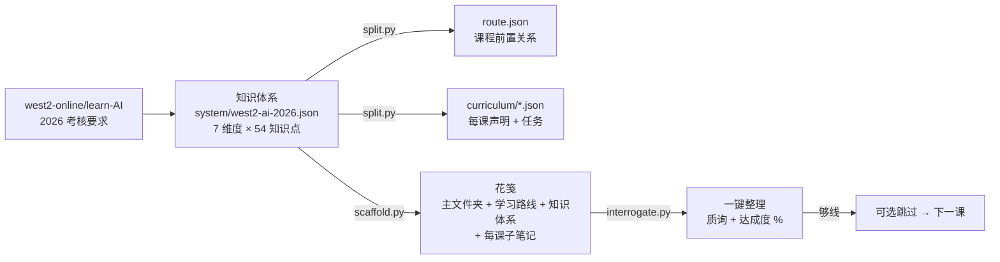

# AI 辅助学习 App · 建设规划（PLAN 模式）

> **状态：规划中，不进行完整构建。**
> 本文件是「等我在 python 上继续学习、完善规划之后再构建」这条决策的落点。
> 任何人在此状态下都不应开始搭 App 的界面与后端骨架。

---

## 0. 为什么停在 plan 模式

已经有一个**能跑通的 P0 掌握闭环**（`study/`），但它还只是"在演示数据上跑通"，不是"在真实学习中被验证过好用"。在这一点被解决之前动手构建 App，风险是**把未经检验的假设固化成架构**。

三个具体的未验证项：

| # | 未验证的事 | 为什么现在验不了 |
| --- | --- | --- |
| 1 | **"必须完全掌握才下一课"在真实学习里是助力还是阻力** | 需要你自己连续用几周才有体感；演示数据回答不了 |
| 2 | **学习库（知识原子）的抽取质量** | 缺第 3 课真实资料（S-H1），目前用的是人工种子 |
| 3 | **门禁的松紧是否合适**（0.85 / 各维 0.6 / 代码量阈值） | 需要真实的提交分布才能校准，拍脑袋定的值大概率要调 |

结论：**先把现有工具当"陪练"用起来攒数据，再决定 App 长什么样。**

---

## 1. 已经能用、现在就可以用的东西

这些**不需要等 App**，今天就能跑：

| 工具 | 状态 | 怎么用 |
| --- | --- | --- |
| **python-tutor** | ✅ 已迁到 deepseek-flash（4.1 Flash）、已加视觉、**已接入 study 桥接** | `E:\Agents\start-python-tutor.bat`；`/study` 可直接看今日复习队列；贴报错截图可让导师看 |
| **java-mentor** | 🟡 仍在 `deepseek-chat`，未迁 flash | `E:\Agents\start-java-mentor.bat` |
| **feishu-notes** | 🟡 仍在 `deepseek-chat` + SiliconFlow 视觉 | 独立脚本，未迁移 |
| **study/ P0 闭环** | ✅ 四维门禁 + 逃生阀 + 回炉 + 笔记体检 + Tutor 点评 | `python study\p0_demo.py` |
| **study/ 体系图** | ✅ 9 课 + 16 知识点 DAG，含一致性校验 | `python study\tools\render_graph.py` |
| **study/ Planner** | ✅ 复习队列 + 今日视图 + 自省周报 | `python study\tools\plan.py` |
| **study/ 学习库** | ✅ 原子存储 + 引文程序化校验 + 人工确认 | `python study\tools\library.py` |
| **花笺连接器** | ✅ 已连上你真实的 `E:\Docs\usual\笔记\notes` | `python study\tools\huajian.py info` |
| **花笺便签墙** | ✅ 已实现（前端 136 项测试通过、构建通过） | 花笺标题栏的网格图标 |
| **知识体系（自上而下管线的源头）** | ✅ `system/west2-ai-2026.json`：7 维度 / 11 课 / 54 知识点，含 west2 原文的「学习目的·内容·要求」 | `python study\tools\system.py summary` |
| **体系校验 + 拆分器** | ✅ 体系 → route.json + curriculum/*.json | `python study\tools\system.py check` / `split` |
| **花笺课程脚手架** | ✅ 主文件夹 + 学习路线 + 知识体系 + 11 篇课程子笔记（要求写在最上面） | `python study\tools\scaffold.py plan` |
| **一键整理：AI 质询 + 达成度** | ✅ 覆盖率(确定性) + 逐点掌握判定 + 苏格拉底追问 + 缺漏清单 + 百分比 + 可跳过判定 | `python study\tools\interrogate.py --course west2-f0` |

**能用但没打通的关键一环**：python-tutor 学会了什么，`study/` 并不知道——两边各存各的。这就是 §2 要解决的事。

---

## 2. 小型可测版本（PLAN 模式下唯一要动手做的事）

> **目标：把 python-tutor 的每一次学习动作，变成 `study/` 能读到的数据。**
> 不新建界面，不搭后端，不写 App 外壳。

### 2.1 做什么

1. **python-tutor 增加事件落盘**（约 30 行）
   - `/done` 验收后，把结果写成 `study/state/` 下的 `findings/<task>.json` 与 `events.jsonl`
   - 内容：本课四维得分、findings（逐行点评）、knowledge_gaps、练习行数
   - **不改教学协议**：导师该怎么教还怎么教，只是"顺手记一笔"

2. **`study/` 提供两个只读命令**（已存在，只需接上数据）
   - `plan.py` → 今天该复习什么
   - `render_graph.py` → 我现在在体系的哪个位置、卡在哪

### 2.2 验收标准（可测量）—— ✅ **已全部验证**

| 验收项 | 结果 | 证据 |
| --- | --- | --- |
| python-tutor 交作业后写入 `study/state/` | ✅ | `study_bridge.py` 落 `findings/py-agent-0N-tutor.json` + `events.jsonl` + `mastery.json` |
| 薄弱点进队列，次日 `plan.py` 能看到 | ✅ | 实测：K3（曾通过）→【复习·回炉未清】；K6（从未通过）→【补练】 |
| 不要求打开 study/ 界面 | ✅ | 导师侧无感知；桥接失败只打印一行提示 |
| 四维不齐时**不误判为已通过** | ✅ | 记录里带 `code_only: true` 与 `needs: [...]`，门禁不会放行 |
| 桥接失败不影响导师 | ✅ | 整体包在 `try/except` 里，纯标准库 |
| **钩子在真实交互循环里会触发** | ✅ | `study/integrations/verify_bridge_hook.py`：打桩 `agent_run` 后用 `/done → /study → /exit` 驱动**真正的 `main()`**，11 项断言全过（含 state 结构断言与运行后状态恢复） |
| **配置开关真的生效** | ✅ | `bridge.enabled` / `bridge.structured_gaps` 原先是死配置，现已接入并验证（离线模式确实不产生薄弱点） |
| **没有课程声明时不产生幽灵知识点** | ✅ | 第 4 课实测：只记 `code` 维 + 标 `code_only`，`atoms` 里**零新增** |

> 关键取舍：python-tutor 只产出**代码 + 点评**，拿不到 quiz/note/transfer。
> 所以桥接**不假装四维齐全**——只写 `code` 维并显式标出缺哪几维。
> 这比"编一个分数让门禁通过"诚实，也让缺口可见。

### 2.3 已知限制（会影响你继续学习，先看这条）

> ⚠️ **`study/curriculum/` 目前只有第 1、2、3 课的课程声明。**
>
> 你学到第 4 课之后，桥接仍然工作，但**只能记录代码维度，不会产生知识点数据**
> （因为没有 K-id 可映射；猜 id 会污染掌握度数据，所以不猜）。
>
> 表现：交作业时会看到
> ```
> ⚠️ study/ 里还没有本课的课程声明 → 只记了代码维度，未产生知识点数据
> ```
> 要恢复完整的知识点映射与复习队列，需要为第 4–9 课补 `declares`
> （每课的知识点清单 + 关键词 + 前置/解锁边）。这是**可随时补**的增量工作，
> 每课约 15 分钟。要不要现在补、还是等你学到那一课再补，由你定。

其它限制：

| 限制 | 说明 |
| --- | --- |
| 练习区是扁平的 | 所有课的练习都堆在 `practice/`，桥接用课程 `exercise` 文本里的文件名来锁定「本课主要文件」；匹配不到就退回全部文件，并在 findings 里记 `primary_matched: false` |
| 只触发于"交作业" | `/done`、`/next`、或说"写好了/交作业"才桥接；纯提问不记录 |
| 四维不齐 | quiz / note / transfer 需在 study 侧完成，桥接不代劳也不编分数 |

### 2.5 自上而下的课程管线（本轮架构反转）

**原来的思路是自下而上**：每课各自声明知识点 → 再拼成体系。
问题：课程是源头，于是"体系缺了什么"没人能发现。

**现在是自上而下**：



体系是**唯一真源**，课程只是它的一种切法。三条由此得到的能力：

1. **不会漏讲**：体系里声明了但没有课程引用的知识点会被校验器直接报出来
   （`knowledge_not_taught`）——这正是旧流程发现不了的问题
2. **换切法不用改内容**：想按周、按难度、按方向重新切课，只改拆分规则
3. **可追溯**：课程里的 `K3` 通过 `source_knowledge` 记住它来自体系的
   `spider.polite`，笔记里写的、点评里提的，都能对回体系

**考核要求是原文不是转述**：`system/enrich_from_west2.py` 从抓下来的
west2 Markdown 里按标题抽「学习目的 / 学习内容 / 学习要求」注入体系，
所以花笺笔记最上面那段要求是**官方原话**。

### 2.6 一键整理：AI 质询怎么算达成度

```
达成度 = 0.4 × 知识点覆盖（确定性关键词匹配）
       + 0.4 × 掌握判定（AI 逐点 pass / partial / missing）
       + 0.2 × 作业进度（笔记里 `- [ ]` 的勾选率）
```

- **覆盖率与作业进度必须确定性**，只有语义判断交给模型
- **够线（默认 70%）且无 blocker → 提示"可以选择跳过进下一课"**，由你决定
- blocker 只有两类：必会知识点未覆盖、**有依据明确的错误**。
  模型找不到依据的存疑只进「待你核对」，**不拦人**（沿用 D7）
- 质询是**提问不是讲解** —— 9 个追问全部是苏格拉底式，不给答案

实测（F0 环境搭建，示例笔记）：

```
达成度 44%（差距较大｜跳过线 70%）
- 知识点覆盖（确定性） 71%  必会 5/7
- 掌握判定（AI 逐点）   39%
- 作业进度（勾选）       0%  0/5
⛔ 必会知识点未覆盖：K3 基本工具与镜像源、K9 基础算法题能力
```

### 2.8 学习位置：课程按「你已经会什么」调整

课程内容（体系）与「你已经会什么」（位置）**必须分开**——否则换个学习者就要改体系。

```
system/west2-ai-2026.json      课程内容（对所有人一样）
system/placement-<你>.json     学习位置（只属于你）
        ↓ split.py 应用位置
curriculum/*.json 带上 prior_status / focus / weak_points
        ↓ scaffold.py --update-placement
花笺课程笔记顶部多一段「⚡ 你的起点」
```

**位置从产物反推，不靠自述。** 每条状态都带证据：

| 证据来源 | 能证明什么 |
| --- | --- |
| `python-tutor/progress.json` | 哪些课被判定通过 |
| `practice/*.py` | **实际写出来的代码**（最硬的证据） |
| `history.json` | 反复答错的点、导师的点评 |
| 本机环境探测 | 装了什么、缺什么 |

**没有证据的一律标 `unknown`（无证据），不假装会。** 只有 `met` 才算已具备。

实测你的位置：

| 代号 | 课程 | 已具备 | 状态 |
| --- | --- | --- | --- |
| F0 | 环境搭建 | 5/9 | 🟡 部分 |
| F1 | 语法基础与简单面向对象 | 4/10 | 🟡 部分 |
| F2 | 网络爬虫与数据分析 | 3/9 | 🟡 部分 |
| F3–ST | 其余 8 门 | 0 | ⬜ 未开始 |

`next` 会告诉你下一步做哪门、还差哪几个知识点，并把薄弱点分成
**本课要先清的**与**其它课遗留的**——不会让你在补 F0 的时候去修 F2 的爬虫解析。

**更新课程笔记时只重写「考核要求」以上部分，「✍️ 我的笔记」以下原样保留**
（`--update-placement`）；找不到分界就跳过而不是冒险覆盖。

### 2.10 导师也归体系管（本轮）

之前 python-tutor 自己维护一份 9 课的老课程表，与 west2 2026 对不上——实测出现过
**「导师说进入第 4 课（爬虫），而它自己的课程表里第 4 课是数据分析」**。
根因不是模型出错，是**课程表有第二个真源**。

现在导师只是体系的一个教学前端：

```
体系 system/west2-ai-2026.json ──export_tutor_lessons.py──> lessons.json（导师课程表）
位置 system/placement-west2.json ─同一脚本 --sync-progress─> progress.json（导师进度）
```

- **课程表由体系生成**：课题=课程、目的=west2 原文的「学习目的」、知识点/作业/自检题都来自体系
- **进度由位置推导**：不再让导师自己数课。实测同步后 `current_lesson = 3 = west2-f2`，
  与「F0/F1 快速过 → 下一步 F2」完全一致
- **快速过会挂账**：`[1] F0 → 快速过（挂账 4）`，`[2] F1 → 快速过（挂账 6）`
- 脚本自动备份被覆盖的 `lessons.json` / `progress.json`

**桥接补齐第二个维度**：`quiz = solid / (solid + gaps)`，来自导师 `/done` 时的逐点考核结论。
现在四维里有 `code` + `quiz` 两维是真数据，`note`/`transfer` 仍明确标缺口（不编分数）。

**知识点键统一为 `<course>:<K-id>`**：结构化抽取返回本地 K-id，自测注入可能给体系全局 id
（如 `spider.parse`），桥接统一翻译一次——否则同一门课会有两套键，掌握度、体系图、
回炉级联、Planner 全部对不上。

### 2.11 不做什么（防止范围膨胀）

- ❌ 不做 Web UI / 桌面外壳
- ❌ 不做多课程并行
- ❌ 不做资料解析（PDF/视频）
- ❌ 不接飞书
- ❌ 不改 python-tutor 的教学协议

---

## 3. 数据契约（冻结，构建 App 时不再变）

这些是 §2 与未来 App 之间的接口。冻结它们，构建时才有稳定地基。

### `study/state/mastery.json`
```jsonc
{
  "lessons": { "py-agent-03": { "mastery": 0.8866, "passed": true, "dims": {...}, "attempts": 2 } },
  "atoms":   { "py-agent-02:K1": { "mastery": 0.616, "passed": false,
                                   "review_queue": true, "recheck_due": false,
                                   "stage": 0, "next_review": "2026-09-17" } }
}
```

### `study/state/events.jsonl`（append-only）
```jsonc
{"ts":"...","kind":"submission","course_id":"py-agent-03","mastery":0.6444,"passed":false,"lines":191,"dims":{...}}
{"ts":"...","kind":"passed","course_id":"py-agent-03","mastery":0.8866,"attempts":2}
{"ts":"...","kind":"reflow","atom":"py-agent-02:K1","before":0.88,"after":0.616}
```

### `study/state/findings/<task_id>.json`
逐行点评的结构化结果，含 `knowledge_gaps`（这是把"点评"变成"自省数据"的关键字段）。

### `study/system/west2-ai-2026.json`（**体系的唯一真源**）
```jsonc
{
  "dimensions": [{"id": "D3", "name": "数据获取"}],
  "knowledge":  [{"id": "spider.polite", "name": "礼貌爬取",
                  "dim": "D3", "level": "must", "keywords": [["robots"], ["限速","sleep"]]}],
  "courses":    [{"course_id": "west2-f2", "title": "...", "stage": "foundation",
                  "requires": ["west2-f1"], "knowledge": ["spider.polite", "..."],
                  "学习目的": "…（west2 原文）", "学习内容": "…", "学习要求": "…",
                  "tasks": [{"id": "t2-1", "type": "code", "title": "...", "brief": "..."}]}]
}
```
`route.json` 与 `curriculum/*.json` 都是**派生物**，请勿手改（文件里也写了这句）。

### 笔记真源
`E:\Docs\usual\笔记\notes`（花笺的 `notesDir`），文件名 `<uuid>_<标题>.md`。
App 只读写普通 Markdown，**不引入私有格式**。

---

## 4. 需要真实数据才能回答的校准问题

这些**不要现在拍板**——等你学几周，用数据回答。

| # | 问题 | 现在的临时值 | 靠什么数据校准 |
| --- | --- | --- | --- |
| 1 | 门禁阈值会不会太严（挫败感）？ | `mastery ≥ 0.85` 且各维 `≥ 0.6` | 「带疑点前进」的使用频率；连续未过次数分布 |
| 2 | 每次回炉的爆炸半径是否过大？ | 级联 3 层内标"待复查" | 一次回炉产生的待复查项数量分布（实测过一次 6 个） |
| 3 | 笔记门槛是否造成摩擦？ | 只卡"必会覆盖 100% + 无事实错误" | 笔记体检的「待确认」占比、补记任务完成率 |
| 4 | 每日任务量是否合理？ | 复习 5–10 分钟/项，未设上限 | 单日队列长度 vs 实际完成数 |
| 5 | `code` 维度的残余方差（±0.03）会不会误判？ | 未装二次判定 | 贴近阈值（±0.05）的提交占比 |
| 6 | **薄弱点抽取是否过于保守** | 提示词写的是"点评没提到的一律算未掌握" | 实测一次点评把 6 个知识点里的 5 个判为未掌握，其中 4 个曾通过 → **一次交作业产生 4 个回炉项**。需要看真实使用中这个比例是否稳定偏高；若偏高，应改成"只有点评明确指出问题才算薄弱点" |

---

## 5. 从 plan 模式转入构建的条件

三条**同时**满足才动手：

1. **连续使用 ≥ 3 周**，且每周至少 2 次真实提交（不是演示数据）
2. **校准问题 1–3 有数据答案**（不是"我觉得"）
3. **§2 的小型可测版本验收标准全部通过**

在此之前，任何"要不要加个界面"的讨论都只是空转。

---

## 6. 构建时的分期草案（会按校准结果改）

| 阶段 | 内容 | 前置 |
| --- | --- | --- |
| B0 | 学习库真实化：用真实资料跑原子抽取（S-H1），替换种子内容 | 你提供第 3 课资料 |
| B1 | py-tutor 与 study 合并成一个可执行入口（CLI 即可，仍不做 UI） | §2 完成 |
| B2 | 桌面/Web 外壳：只读视图（体系图 + 今日任务 + 笔记） | 校准问题 4 有答案 |
| B3 | 可写界面：笔记编辑、任务勾选、复习交互 | B2 稳定使用 2 周 |
| B4 | 多课程扩展（java-mentor / 其他语言） | B3 |
| B5 | 飞书管道（发布/知识库/移动阅读） | B4 |

**每期都以"上一期被真实使用过"为前置**，避免一次做太大。

---

## 7. 明确不做（无论哪个阶段）

- 不做通用笔记软件去对标飞书/Notion——价值在"课程目标 → 笔记 → 答疑 → 复习"的闭环
- 不做资料的通用解析（PDF/OCR/视频转写）——质量不可控，等 B0 之后再议
- 不做云端多人协作
- 不让 AI 直接改用户的笔记（只出建议 diff）
- 不让 AI 在无出处的情况下判定用户"写错了"（derived 原子不得作判错依据）

---

## 8. 本期实际交付（PLAN 模式这一轮）

| 交付 | 位置 |
| --- | --- |
| **知识体系（自上而下源头）** | `study/system/west2-ai-2026.json` |
| **体系校验 + 拆分器** | `study/system/split.py` · `study/tools/system.py` |
| **从 west2 原文注入考核要求** | `study/system/enrich_from_west2.py` |
| **花笺课程脚手架** | `study/tools/scaffold.py` |
| **一键整理（AI 质询 + 达成度）** | `study/notedoctor/interrogator.py` · `study/tools/interrogate.py` |
| 演示用示例笔记灌入 | `study/integrations/seed_demo_note.py` |
| **小型可测版本：python-tutor → study/ 数据桥** | `E:\Agents\python-tutor\study_bridge.py` |
| **桥接钩子端到端验证（11 项断言，驱动真实 `main()`）** | `study/integrations/verify_bridge_hook.py` |
| `/study` 命令（导师内看今日复习/补练） | `E:\Agents\python-tutor\tutor.py` |
| `__main__` 顺序 bug 修复（上一轮迁移遗留） | `E:\Agents\python-tutor\tutor.py` |
| 从自由点评抽取薄弱点 | `study/tutor/reviewer.py: extract_knowledge_gaps` |
| 花笺「便签墙」功能 | `refs/floral-notepaper/src/components/NoteWall.tsx` + `src/features/notes/noteWall.ts` |
| 花笺多层分类补丁（已用 155 项测试验证） | `refs/floral-notepaper/PATCH-多层分类.diff` |
| python-tutor → 4.1 Flash + 视觉 | `E:\Agents\python-tutor`（有 `*.bak-20260916-122427` 备份） |
| west2 考核原文（抓取留档） | `refs/learn-AI/` |
| 本规划文件 | `docs/AI辅助学习-App-建设规划（plan模式）.md` |

**测试总览**：`study/` **257 项**通过；桥接钩子端到端 11 项断言通过；
花笺前端 136 项通过 + `vite build` 通过。
