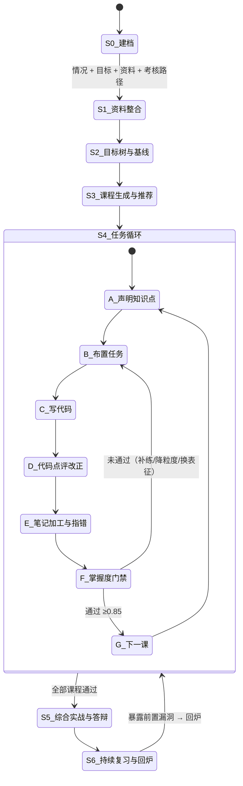

# AI 辅助学习 App · 系统设计（融合版）

> 定位：**用 `python-tutor` 的教学循环 + `java-mentor` 的测评闭环 + `feishu-notes` 的笔记管道，融合成一个能解决"自主学习五无"的学习系统。**
> 初级目标：**代码学习**（理论 + 实践结合，以"能写出代码"为验收标准）
> 上游文档：`AI辅助学习-App-可行性分析.md`、`Phase1-Markdown笔记模式-设计.md`
> 现有资产：`E:\Agents\{python-tutor, java-mentor, feishu-notes}`

---

## 0. 一句话定位

> 市面上的学习工具解决"资料在哪"，这个 App 解决"**今天该学什么、学到什么程度算学会、卡住了谁拉我一把**"。

三个已有 Agent 各自只覆盖了一环：

| 已有 | 覆盖了什么 | 缺什么 |
| --- | --- | --- |
| `python-tutor` | 布置作业 → 你写代码 → 对着代码修正知识 → `/done` 验收 → 下一课 | 课程写死的、无体系图、无笔记环节、无测评基线 |
| `java-mentor` | `/assess` 摸底 → 能力雷达 → 缺漏清单 → 逐项巩固 → 综合实战 | 只有检测+补漏，不生成课程、不产出笔记 |
| `feishu-notes` | 飞书文档块级读取、图片 OCR、AI 整理、幂等写回/发布 | 与学习行为完全脱钩——它不知道你学到哪、错在哪 |

**融合后的增量不是"把三个脚本拼起来"**，而是补上中间缺失的四块：**学习库、知识点体系图、笔记医生、掌握度门禁**。

---

## 1. 现有资产盘点（源码级）

### 1.1 `python-tutor`（24.8 KB，纯标准库）

| 资产 | 位置 | 复用方式 |
| --- | --- | --- |
| **三段式教学协议**（阶段 A 布置作业 / B 验收与知识修正 / C 通过验收） | `tutor.py:305-344` | ⭐ **核心资产，直接继承并扩展** |
| 工具协议 `list_files` / `read_file` / `run_code` / `update_progress` | `tutor.py:239-287` | 扩展为多语言 runner + 新增笔记/测评工具 |
| 验收输出模板：`【🧪 作业检查】`→`【📚 知识修正】`→`【❓ 自检追问】` | 协议文本内 | 扩展第 4 段`【🔗 知识定位】`（挂到体系图哪个节点） |
| 课程表 schema：`{id, title, goal, knowledge[], exercise, self_check[]}` | `lessons.json` | ⭐ **课程模型的基础，扩展 `prerequisites` / `tasks` / `gate`** |
| 考核路径样板：**西二在线 learn-AI 强化版**（9 课） | `lessons.json.title/note` | ⭐ **"无目标"的现成解药**：目标树可由公开考核路线实例化 |
| 进度模型 `progress.json`：`current_lesson` / `lessons_done` / `log` | 文件 | 演进为 `mastery.json` |
| 跨天记忆 `history.json` + `trim_history` | `tutor.py:349` | 直接复用 |

### 1.2 `java-mentor`（28.3 KB）

| 资产 | 位置 | 复用方式 |
| --- | --- | --- |
| **测评协议**：`/assess` → 逐题批改 → `【📊 能力雷达】`→`【🔍 缺漏清单】`→`【📋 学习路线建议】` | `mentor.py:327-332` | ⭐ **"无目标 + 无自省"的基线机制**，作为全流程的 S1 入口 |
| 7 大模块题库结构 `{id, title, brief, knowledge[], checkpoints[], tasks[]}` | `mentor.py:52-81` | ⭐ 比 `lessons.json` 多出 **`checkpoints`（验收入口）** 和 **`tasks`（多条任务）**——融合后的课程 schema 应取两者并集 |
| 以**用户真实项目为教材**（读 Draw 源码出题、对照讲解） | `config.json.roots` | ⭐ **关键洞察**：学习资料不必是外部教材，"你自己写的代码"就是最好的教材 |
| 多根目录读取 `_resolve(root_key, rel)` + `list_root` | `mentor.py:178-205` | 复用为统一文件访问层 |
| `update_progress(action=assess/pass, topic_id, score)` | `mentor.py:244` | 演进为掌握度写入接口 |
| 阶段 2「综合实战」：给存量项目做改造 | 协议 | 复用为课程的"毕业设计"环节 |

### 1.3 `feishu-notes`（38.2 KB，纯标准库）

| 资产 | 位置 | 复用方式 |
| --- | --- | --- |
| 块级读取 `read_all_blocks` / `flatten_doc`（保留标题层级、代码块、图片原位） | `note_tidy.py:129-229` | ⭐ **飞书 → Markdown 的唯一可行通道**（官方导出不支持 md） |
| 块类型映射表 `BT_NAMES` / `LANG`（代码语言枚举 → 高亮名） | `note_tidy.py:38-45` | 直接复用 |
| 图片 OCR/VLM 描述 `vision_caption`（SiliconFlow PaddleOCR-VL） | `note_tidy.py:292` | ⭐ 资料解析的第一步，也用于"截图笔记"理解 |
| AI 整理 `deepseek_tidy` + 外置提示词 `prompt_tidy.txt` | `note_tidy.py:329` | ⭐ **笔记加工的骨架**（但目标要从"排版整理"升级为"学习体检"） |
| Markdown → 飞书块 `markdown_to_blocks` / `parse_md_for_blocks` | `note_tidy.py:644-730` | ⭐ 本地 md → 飞书发布的通道 |
| 幂等映射 `doc_map.json`（源文档 token → 目标文档 token） | `note_tidy.py:488-508` | ⭐ **扩展到 note_id ↔ 飞书 node_token**，是双端不断链的关键 |
| 目录镜像 `ancestor_folder_path` / `ensure_folder_path` | `note_tidy.py:418-461` | 复用为"课程目录 → 飞书知识库"结构同步 |

### 1.4 ⚠️ 盘点中发现的安全问题（建议优先处理）

三个 `config.json` 中存在**明文密钥**：DeepSeek API Key、SiliconFlow API Key、飞书 `app_secret`。其中 `python-tutor` 与 `feishu-notes` 的 DeepSeek Key 是同一个。

建议：改用环境变量（`java-mentor` 已支持空 key 回退环境变量），或抽出一个 `E:\Agents\.secrets\` 统一管理；**飞书 app_secret 若曾出现在任何会外传的文件里，应在开放平台重置一次**。本设计后续所有文档都不再复述密钥内容。

---

## 2. 五大痛点 → 五套机制（产品骨架）

| 痛点 | 根因 | 机制 | 落地产物 |
| --- | --- | --- | --- |
| **无目标** | 不知道"学到什么程度算够" | **目标锚定**：用考核路径 + 用户自述目标 + 基线测评，生成**可验证**的目标树（每个叶子目标 → 对应知识点 → 对应任务） | `profile.json` / `goals.json` |
| **无规划** | 目标不会自动变成日程 | **任务驱动排程**：课程 → 任务卡 → 日/周视图；每课先声明知识点再布置任务 | `curriculum/*.json` / `plan.json` |
| **无体系** | 知识点是孤岛 | **知识点图谱（DAG）**：前置依赖 / 同类对比 / 跨课应用三类边 + 笔记双链；每次点评都告诉你"这个点挂在哪" | `graph.json` |
| **无自省** | 没有反馈回路 | **掌握度模型 + 笔记体检 + 薄弱点档案**：能力雷达时间序列、课末复盘三问、周报 | `mastery.json` / `review_report.md` |
| **无人指导** | 卡住没人拉 | **双导师**：代码导师（逐行点评改正）+ 笔记医生（加工内容、指出错误、联系相关知识） | `findings.json` / 笔记体检报告 |

> 这套映射的一个直接推论：**AI 的价值不在于"讲得多好"，而在于"每次都给一个可验证的下一步"**。所有机制最终都收敛到 `下一个任务是什么`。

---

## 3. 端到端流程（状态机）



### 逐步说明

**S0 · 建档（Intake）**
用户一次性给出四样东西（对话式采集，不是表单）：
1. **情况**：基础（如"扎实 C/C++，无 Python"）、可投入时间（每天 1.5h）、设备
2. **目标**：要达成的能力（如"能自己写 Function Calling Agent"）
3. **资料**：本地文件 / 飞书文档链接 / 网页 / 代码仓库路径（可直接吃 `java-mentor` 的 `roots` 模式）
4. **考核路径**：可选。可导入公开路线（`lessons.json` 已在用 **west2-online/learn-AI**），或用户自定

输出 `profile.json`。**这一步就消掉一半的"无目标"**——因为目标被写成了可检查的文本。

**S1 · 资料整合 → 学习库（Library）**
资料 → 解析（PDF/网页/飞书文档/代码仓/用户已有笔记）→ **知识原子**（见 §4）。
这是草图里 `资料1/资料2 → 精细数据库` 的真正落地：不是存文件，是**抽出可被任务和点评引用的最小知识单元**。

**S2 · 目标树 + 基线测评**
- 目标树：`目标 → 能力域 → 知识点 → 验收任务`（四层，每层都可验证）
- 基线测评：直接复用 `java-mentor` 的 `/assess` 协议，产出 `【📊 能力雷达】+【🔍 缺漏清单】`
- **交叉裁剪**：目标树 ∩ 缺漏清单 = 真正要学的范围；已在基线里证明掌握的点**直接跳过**（解决"有基础的人被迫从头学"）

**S3 · 课程生成与推荐**
- 按主题生成 N 门课，每门课是一条独立可完成的链路
- **推荐顺序**由 DAG 拓扑排序 + 缺漏优先级 + 用户兴趣共同决定
- 生成时必须**先声明该课的知识点**（用户明确要求），并标注它**串联了哪些前置、解锁了哪些后续**

**S4 · 任务循环（主体，见 §6–§9）**

**S5 · 综合实战与答辩**
全部课程通过后，沿用 `java-mentor` 阶段 2：拿用户自己的真实项目做改造，AI 当架构评审 + 答辩官。

**S6 · 持续复习与回炉**
薄弱点档案 → 间隔重复队列；后续课程暴露前置漏洞 → **自动把前置知识点重新拉回队列**（这是"体系"能自我修复的关键）。

---

## 4. 学习库（Learning Library）：三层结构

```
library/
├── raw/                    # ① 原始资料层（不可变，只追加）
│   ├── <course>/<file>.pdf
│   ├── feishu/<doc_token>.md      # 由 feishu-notes 的 flatten_doc 导出
│   └── code/<repo>/...            # 用户真实项目快照（java-mentor 模式）
├── atoms/atoms.jsonl       # ② 知识原子层（AI 抽取 + 人工确认）
└── views/<course>.json     # ③ 课程视图层（有序引用 atom_id，不复制内容）
```

**为什么不直接把资料塞进向量库？** 因为"任务 / 点评 / 体检"都需要**可引用的稳定单元**。向量 chunk 无法作为"这个知识点你还没掌握"的记账对象。

### 知识原子 schema

```json
{
  "atom_id": "a_py_0042",
  "type": "concept | example | exercise | pitfall | api | formula",
  "title": "GIL 全局解释器锁",
  "statement": "CPython 中同一时刻只有一个线程执行字节码……",
  "why": "解释了为什么 CPU 密集多线程不加速",
  "source": { "kind": "material", "ref": "raw/py/流畅的Python.pdf#p412", "confidence": 0.92 },
  "lang": "python",
  "prerequisites": ["a_py_0011"],
  "related": ["a_py_0067"],
  "contrast": ["a_cpp_0003"],
  "mastery": 0.0,
  "evidence": [],
  "tags": ["并发", "性能"]
}
```

**抽取规则（`prompt_tidy.txt` 的升级方向）**：
- 只抽**可被检验**的内容（有定义、有示例、有反例、有易错点）
- 每条原子必须带 `source.ref`（能点回原文），抽不出出处的**不许入库**——这是防幻觉的第一道闸
- `contrast` 字段专为"C/C++ 对照"教学写：`list≈vector`、`with≈RAII`、`GIL vs 真并行`
- 抽取结果进 `atoms.pending`，**由用户一键确认/批量接受**后才生效（延续"AI 只给建议"的原则）

---

## 5. 知识点体系（解决"无体系"）

### 5.1 三类边

| 边 | 含义 | 教学用途 |
| --- | --- | --- |
| `prerequisites` 前置 | 不学 A 学不会 B | 门禁：前置未过不许开 B；**回炉**：B 挂了就回头查 A |
| `contrast` 对比 | A 与 B 是同一问题的不同解法/语言 | 讲 B 时主动对照 A（`java-mentor` 的 C/C++ 对照就是这类边） |
| `applies_to` 应用 | A 在真实场景 C 里被用到 | 讲 A 时给真实落点（如"JWT 签名 → Draw 的 JwtService"） |

### 5.2 课程 schema（取 `lessons.json` 与 `mentor.py TOPICS` 的并集并扩展）

```json
{
  "course_id": "py-agent-01",
  "title": "Python 语法速览 + 面向对象（C/C++ 对照）",
  "goal": "扫清语法差异并掌握 OOP 写法，为爬虫与数据分析打底",
  "declares": {
    "knowledge": [
      { "atom_id": "a_py_0001", "name": "dataclass", "level": "must" },
      { "atom_id": "a_py_0002", "name": "魔术方法 / 运算符重载对照", "level": "must" },
      { "atom_id": "a_py_0003", "name": "GIL", "level": "should" }
    ],
    "prerequisites": ["py-agent-00"],
    "unlocks": ["py-agent-02"],
    "system_position": "Python 基础层 → 网络层 的第一跳"
  },
  "theory": [
    { "atom_id": "a_py_0002", "brief": "只讲差异，不科普入门概念" }
  ],
  "tasks": [ /* 见 §6 任务卡 */ ],
  "self_check": [
    "list 推导式把 [1,2,3] 变 [2,4,6]？",
    "with 与 C++ RAII 的异同？",
    "为什么 Python 多线程算不快？与 C++ 线程差别？"
  ],
  "gate": { "min_mastery": 0.85, "min_each": 0.6, "min_practice_lines": 120, "require_transfer": true }
}
```

**"先声明知识点"的 UI 呈现**（这是用户明确要求的）：
进入新课先显示一张**知识卡**：

```
📚 第 3 课：网络爬虫
   本课知识点（3 个必会 / 2 个了解）
   ├─ [必会] HTTP 请求/响应结构     ← 前置：第 2 课 HTTP 基础 ✅
   ├─ [必会] requests + 解析        ← 全新技术
   ├─ [必会] 异常与重试             ← 前置：第 1 课 try/with ✅
   ├─ [了解] robots.txt 与限速
   └─ [了解] 反爬初步
   🔗 它在体系中的位置：Python 基础 →【网络层】→ 数据分析
   🎯 学完你能做：抓取一个真实网站并落盘成结构化数据
   ⬇ 解锁：第 4 课 数据分析
```

体系图可视化：DAG，节点着色 = 掌握度（灰=未学 / 黄=进行中 / 绿=已过 / 红=回炉），点节点可跳转到对应原子、任务、笔记。

---

## 6. 任务驱动引擎（解决"无规划"）

### 6.1 任务卡 schema

```json
{
  "task_id": "t_py01_2",
  "course_id": "py-agent-01",
  "type": "concept | code | refactor | transfer | note",
  "title": "用 @dataclass 定义 Student 并写 assert 自测",
  "brief": "定义 Student(name, gid, courses: list[str])，实现 grade()/summary()，用 assert 覆盖空课程与多课程两种情况",
  "atoms": ["a_py_0001", "a_py_0002"],
  "deliverable": "practice/py01_oop.py",
  "acceptance": ["能跑通", "有 assert 自测", "无显式 for 循环（Pythonic）"],
  "est_minutes": 45,
  "theory_ref": ["a_py_0002"],
  "status": "todo | doing | blocked | review | passed"
}
```

### 6.2 五类任务的配比（理论 + 实践结合）

| 类型 | 作用 | 占比建议 |
| --- | --- | --- |
| `concept` 概念验证 | 用最小代码证明理解（如"证明 GIL 存在"） | 20% |
| `code` 代码实践 | 主体训练量，**保证代码量** | 45% |
| `refactor` 重构 | 拿自己的旧代码改（`java-mentor` 的"改造 Draw"） | 15% |
| `transfer` 迁移 | 换场景/换输入，**防背答案** | 15% |
| `note` 笔记 | 输出结构化笔记（见 §8） | 5%（但必过） |

**"足够的代码量"怎么保证**：`code` + `refactor` 任务的 `min_practice_lines` 累加进课程门槛；`run_code` 的次数与失败次数也记录，形成"动手密度"指标（每周统计）。避免"光看视频不写代码"。

### 6.3 排程
- 由 `est_minutes` + 用户每天可投入时间 → 生成日/周视图
- 任务阻塞（`blocked`）超时 → 自动降级粒度（把一个大任务拆成 2–3 个小任务），而不是干等
- 未完成任务**不自动堆积**：每周复盘时显式让用户决定"补做 / 顺延 / 放弃"

---

## 7. 代码导师（点评改正）

**这是 `python-tutor` 最成熟的部分，直接继承并增强。**

### 7.1 循环
```
布置任务 → 用户在 practice/ 写代码 → /done
   ↓
[工具] list_files → read_file → run_code（真实执行，看报错）
   ↓
四段式输出（在原有三段上增加第 4 段）
【🧪 作业检查】  能跑通？整体评价（先肯定）
【📚 知识修正】  逐条锚定代码行：第 N 行 xxx → 概念 → 正确写法 → 为什么 → C++ 类比
【🔗 知识定位】  ← 新增：这个问题属于体系图哪个节点，影响哪些后续课程
【❓ 自检追问】  1–2 个引导问题，不直接给答案
   ↓
结构化落盘 findings.json → 其中 errors[] 自动进笔记的「易错点」与薄弱点档案
```

### 7.2 `findings.json`（让点评可追溯、可统计）

```json
{
  "task_id": "t_py01_2",
  "ran": true,
  "run_result": { "exit_code": 0, "stdout": "...", "stderr": "" },
  "findings": [
    { "severity": "error | warn | style | praise",
      "line": 3, "code": "a = a + b",
      "issue": "可用累加但更 Pythonic 的写法是……",
      "atom_id": "a_py_0007",
      "fix_hint": "……" }
  ],
  "self_check_questions": ["……"],
  "knowledge_gaps": ["a_py_0007"]
}
```

**关键**：`knowledge_gaps` 直接写入掌握度模型——**"点评"不只是聊天，而是自省机制的数据来源**。这是三个现有 Agent 都缺的一环。

### 7.3 多语言 Runner
现有 `run_code` 仅 `RUN_SAFE_PREFIX = "python"`。扩展为：

| 语言 | 运行方式 | 沿用 |
| --- | --- | --- |
| Python | `python <file>`（受限前缀 + 超时 20s） | `tutor.py:191` |
| Java | `java <file>.java`（单文件，JDK 21） | `mentor.py:218` |
| 其他 | 可配置 runner 白名单 | 新建 |

安全约束保持不变：**只允许运行练习区/工作区内文件，只允许白名单解释器，超时强杀**。

### 7.4 引导而不代写（协议红线）
沿用现有规则：除非用户明确说"给我答案"，否则只给提示。**这条要写进所有角色的 system prompt**——它正是"无人指导"与"AI 代写"的分界线。

---

## 8. 笔记医生（加工 + 指错，解决"无人指导"的笔记侧）

用户明确要求：**"用户更新笔记 → AI 对笔记内容进行加工以及指出错误 → 联系相关知识帮助体系化构建"**。

这与 `feishu-notes` 现在的目标不同：现有 `prompt_tidy.txt` 做的是**排版整理**（合并空行、修标题层级、生成预告）。**笔记医生要做的是"学习体检"**。

```
输入:  { note_md, course_id, atoms[], findings.json, graph }
输出:  笔记体检报告 + 结构化建议
```

### 8.1 五维体检

| 维度 | 检查什么 | 输出 |
| --- | --- | --- |
| **① 结构** | 有没有标题层级、有没有"结论/例子/总结" | 排版建议 diff |
| **② 覆盖** | 本课 `knowledge[]` 里哪些原子**笔记里没提** | 缺口清单 → 生成补记任务 |
| **③ 准确** | **事实性错误 / 理解偏差**（必须引用 `source.ref` 作为依据，否则不许下结论） | 逐条纠错 + 依据链接 |
| **④ 关联** | 该不该链到前置/对比/应用（`[[...]]`、`contrast`） | 建议双链 |
| **⑤ 自产** | 是否只是抄录，有没有自己的话/例题/反例 | 复述任务（"用你自己的话写一遍 GIL"） |

### 8.2 体检报告示例

```
📋 笔记体检 · 第 3 课 网络爬虫
① 结构   7/10  缺"总结"小节
② 覆盖   6/10  ⚠️ 未提及：异常与重试（本课必会知识点）
③ 准确   8/10  ❌ 第 12 行"requests 会自动重试" —— 依据 raw/py/requests.md#retry，默认不重试
④ 关联   5/10  建议补链：[[HTTP 请求结构]]、对比 [[Java HttpClient]]
⑤ 自产   6/10  3 段为新概念复述，建议用自己话重写 1 段
→ 结论：未达"笔记质量"门槛（需 ≥ 7 分且覆盖必会 100%）
→ 已生成 2 个补记任务
```

**设计红线**：
- **AI 只出建议 diff，用户逐条接受**（延续可行性文档已确立的原则）
- **纠错必须带出处**；无依据的"疑似错误"只能标注为"待确认"，不许直接判定
- 笔记门槛**不要求文采**，只要求：必会知识点覆盖 100% + 无事实错误 + 有自己的话

### 8.3 与 `feishu-notes` 的分工

| 管道 | 触发 | 作用 |
| --- | --- | --- |
| **发布管道**（复用 `note_tidy.py`） | 笔记定稿后 | 本地 md → 飞书文档（`markdown_to_blocks` / `create_children`），`doc_map.json` 做幂等更新 |
| **体检管道**（新建 NoteDoctor） | 每次笔记更新 | 五维体检 → 补记任务 → 门禁输入 |
| **回流管道**（复用 `read_all_blocks`） | 用户在飞书端改了 | 块级读回 → 差异提示（不自动覆盖本地，见可行性文档约束） |

---

## 9. 掌握度门禁（"必须用户完全掌握"的落地）

### 9.1 四维加权

```
mastery(lesson) = 0.35·code + 0.25·quiz + 0.20·note + 0.20·transfer
```

| 维度 | 取值方式 |
| --- | --- |
| `code` | 0.6 × 任务通过率 + 0.4 × 健壮性（边界用例 / 异常处理 / 命名与风格） |
| `quiz` | `self_check` 每题 0 / 0.5 / 1（0.5 = 结论对但表述是抄的；1 = 自己的话 + 能举反例） |
| `note` | §8 体检五维加权（结构 0.2 / 覆盖 0.3 / 准确 0.3 / 关联 0.1 / 自产 0.1） |
| `transfer` | 迁移题得分（换场景或换输入，严禁与练习题同构） |

> **⚠️ `code` 公式的两条修正（实跑逼出来的，见 `study/gate/codecheck.py`）**
>
> 1. **`style` 不扣分**。首版按 style 0.05 / warn 0.15 线性扣分，结果首次端到端运行就翻车：
>    Tutor 认真给出 4 warn + 3 style → 扣 0.75 → `code` 掉到 0.70 → **场景 B 未通过**。
>    这形成了**逆向激励：点评越认真、评分越低**。现改为 `error 0.30 / warn 0.08 / style 0`。
> 2. **扣分封顶 0.5**。好导师本来就会给很多条改进建议，线性累加会把"认真点评"当成"代码很差"。
>    封顶后 `code` 的下限仍由机检通过率主导（`0.6 × ratio`）。
>
> **已知残余方差**：`quiz` / `note` / 门禁判定在 `thinking=disabled + temperature=0` 下**逐字可复现**；
> 但 Tutor 的 `findings` **条数**是开放式的，同一份代码两次运行可能给出 4 条或 5 条 warn
> （实测 `code` 波动约 ±0.03）。这不影响本次结论（A 0.644 远低于门限、B 0.887 高于门限），
> 但**贴近阈值时需要用 §3.4 的"二次判定"兜底**。

**门禁条件**（全部满足才解锁下一课）：
```
mastery ≥ 0.85  且  min(code, quiz, note, transfer) ≥ 0.6  且  无 fatal（致命误解）  且  必会知识点覆盖 100%
```

### 9.2 未通过的三级处理（而不是简单"重做"）

| 级别 | 触发 | 处理 |
| --- | --- | --- |
| **L1 补练** | 某一维 0.6–0.85 | 只补该维度的短板任务（如只补迁移题） |
| **L2 降粒度** | 同一课连续 2 次未过 | 把课程拆成 2–3 个更小单元，知识点不变 |
| **L3 换表征** | 同一知识点连续 3 次未过 | 换教学方式：讲原理 / 给类比（C++ 对照）/ 给可视化 / 读源码（`java-mentor` 的"读真实代码"） |

### 9.3 回炉机制（体系自修复）
后续课程里若 `findings.knowledge_gaps` 命中**已判定通过的前置原子** → 该原子 `mastery` 打折（×0.7）并**重新进入复习队列**，同时提示："第 3 课暴露了第 1 课的 `with/RAII` 没吃透，已安排 2 个回炉任务。"

### 9.4 ⚠️ 一条重要的产品建议

"必须完全掌握才下一课"是很强的承诺，但**硬门禁有真实的弃用风险**：学习者在 0.8 分附近反复挫败时会直接放弃，而不是继续练。

建议采用 **"硬门禁 + 逃生阀"**：
- 默认硬门禁（符合你的要求）
- 未通过时提供**显式选项**：「带疑点前进」——需用户手动确认，且该知识点被标记为 `carried_over`，**强制挂进复习队列并在下一课开头重新考核**
- 数据上区分"真掌握"与"带账通过"，能力雷达如实反映

这样既守住"完全掌握"的标准，又不会把人逼走。

> ✅ **决策已定（D3）**：**采纳"硬门禁 + 逃生阀"**。S4 全部 10 项决策已冻结，详见 `AI辅助学习-App-可行性深化（S4定案版）.md` §2。

---

## 10. 自省机制（解决"无自省"）

| 机制 | 频率 | 内容 |
| --- | --- | --- |
| **课末复盘三问** | 每课通过后 | ① 这课我真正学会了什么（用自己的话）② 我在哪卡住了、怎么出来的 ③ 它和我已知的什么有关。**由用户作答，AI 只反馈不打分**（打分就会变成应付） |
| **能力雷达** | 每周 | 复用 `mentor.py` 的 `fmt_scores` 思路，画时间序列：不是单点分数，而是**曲线**——看的是趋势 |
| **周报** | 每周 | 新增知识点数 / 掌握度变化 / 代码行数与运行次数 / 未过任务 / 笔记产出 / 下周建议 |
| **薄弱点档案** | 实时 | `knowledge_gaps` 汇总，按"反复出现"排序——**反复错 3 次的点，比一次考 0 分的点更值得干预** |
| **复习队列** | 每日 | 间隔重复（FSRS/SM-2），到期知识点 → 生成 5–10 分钟的小任务，而不是"重新看一遍资料" |

---

## 11. 数据模型与目录结构

```
E:\Study\                              # 应用根（与 E:\Agents 解耦，Agents 作为引擎库被调用）
├── profile.json                       # 画像：基础 / 时间 / 目标 / 偏好 / 语言
├── goals.json                         # 目标树（可验证叶子）
├── library/
│   ├── raw/                           # 原始资料（不可变）
│   ├── atoms/atoms.jsonl              # 知识原子
│   └── views/<course>.json            # 课程视图
├── curriculum/<course_id>.json         # 课程（扩展版 lessons.json schema）
├── graph.json                         # 知识点 DAG（三类边）
├── mastery.json                       # 掌握度 / 雷达 / 薄弱点 / 回炉队列
├── findings/<task_id>.json            # 每次代码点评的结构化结果
├── notes/                             # Markdown 笔记（规范见 Phase1 文档）
│   ├── <course>/<NN-title>.md
│   └── _course.md
├── practice/                          # 代码练习区（python-tutor 模式）
├── inbox/                             # 快速捕获
├── reports/                           # 周报 / 体检报告 / 复盘
├── history.json                       # 对话记忆（跨天）
└── vendor/agents/                     # 复用 E:\Agents 的引擎（或直接引用其路径）
```

**沿用既有原则**：`*.json` 索引类文件**全部可删除重建**，Markdown 与原始资料才是真源。

---

## 12. Agent 编排：七个角色

| 角色 | 职责 | 输入 | 输出 | 主要复用 |
| --- | --- | --- | --- | --- |
| **① Intake 建档官** | 把"情况/目标/资料/考核路径"变成结构化画像 | 用户自述 | `profile.json` | 新建 |
| **② Curator 资料官** | 资料 → 知识原子 | `raw/`、飞书链接、代码仓 | `atoms.jsonl` | `feishu-notes` 的 flatten + vision + 新抽取提示词 |
| **③ Architect 课程架构师** | 目标树 + 课程 + 知识点 DAG | profile + atoms + 考核路径 | `curriculum/` + `graph.json` | `lessons.json` / `mentor.py TOPICS` 结构 |
| **④ Tutor 代码导师** | 布置任务 + 逐行点评 | 任务卡 + `practice/` | `findings.json` | ⭐ `tutor.py` 三段式协议 + 4 个工具（近乎直接搬） |
| **⑤ NoteDoctor 笔记医生** | 五维体检 + 指错 + 补记任务 | 笔记 md + atoms | 体检报告 + diff 建议 | `feishu-notes` 的 tidy 骨架 + 新体检提示词 |
| **⑥ Examiner 考官** | self_check + 迁移题 + 门禁判定 | 代码 / 回答 / 笔记 | `mastery.json` 更新 | `mentor.py` 打分 + `update_progress` |
| **⑦ Planner 规划师** | 排程 / 复习队列 / 周报 / 回炉 | mastery + 时间预算 | `plan.json` + `reports/` | 新建（`progress.json` 思路延伸） |

**编排原则**：
- 角色之间**只通过文件（JSON）通信**，不靠对话上下文传递状态 → 可单独重跑、可调试、可替换模型
- 每个角色的产物都**可被用户直接查看和修改**（透明优先于自动）
- **统一工具集**：`list_files / read_file / run_code / write_note / update_mastery / link_atom`——所有角色共用，权限按目录白名单收敛

---

## 13. 飞书的位置（承接既有结论）

| 用途 | 通道 | 状态 |
| --- | --- | --- |
| 资料输入 | 飞书文档 → `read_all_blocks` → `raw/*.md` | ✅ 已有（`feishu-notes`） |
| 笔记发布/分享 | 本地 md → `markdown_to_blocks` → 飞书文档 / 知识库 | ✅ 已有，需补 wiki 挂载 |
| 移动端阅读 | 飞书 App 直接看 | ✅ 天然 |
| 反向编辑回流 | 飞书 → blocks → md 差异提示 | ⚠️ 有损，仅提示不覆盖 |
| 结构化数据（题库/错题本） | 多维表格 bitable | 未做 |

**不变的架构结论**：**本地是真源，飞书是出口。** 官方导出不支持 Markdown 这一约束依旧成立。

---

## 14. 复用 vs 新建（工作量清单）

| 模块 | 复用度 | 说明 |
| --- | --- | --- |
| 代码点评循环 | 🟢 80% | `tutor.py` 协议 + 工具几乎可直接搬，加"知识定位"段与多语言 runner |
| 测评 / 雷达 / 缺漏 | 🟢 75% | `mentor.py` 直接复用，输出改为写入 `mastery.json` |
| 飞书读写 / 发布 / OCR | 🟢 85% | `note_tidy.py` 全部复用，`doc_map` 扩展 note_id 映射 |
| 课程卡 / 任务卡 | 🟡 50% | 结构已存在（`lessons.json` + `TOPICS`），需并集 + 扩展门禁字段 |
| **学习库（原子抽取）** | 🔴 20% | 提示词要重写（从"排版整理"→"可检验知识原子 + 出处"） |
| **知识点 DAG** | 🔴 0% | 全新 |
| **笔记医生（五维体检）** | 🔴 15% | 有骨架，体检逻辑全新 |
| **掌握度门禁** | 🔴 10% | 全新（现有只有 `lessons_done` 二元标记） |
| **Planner / 周报 / 复习队列** | 🔴 5% | 近乎全新 |
| **应用外壳（Web/CLI）** | 🔴 0% | 全新 |

**结论**：**"教与评"的引擎已经成熟（可复用 75–85%），"库/体系/自省"是真正要新建的部分。** 这也印证了融合的价值——不是重写，而是补缺口。

---

## 15. 分期路线

| 阶段 | 目标 | 关键交付 | 复用 |
| --- | --- | --- | --- |
| **P0 · 单课闭环** | 把一门课（如现有的"第 3 课 网络爬虫"）跑通**完整闭环**：声明知识点 → 任务 → 代码点评 → 笔记体检 → 门禁 → 下一课 | 知识点声明卡、`findings.json`、笔记体检报告、`mastery.json` 四维评分 | `tutor.py` 为主 |
| **P1 · 学习库与体系** | 资料 → 原子 → 课程视图 → 知识点 DAG → 体系图 | `atoms.jsonl`、`graph.json`、DAG 可视化 | `feishu-notes` + 新建 |
| **P2 · 建档与规划** | 画像 → 目标树 → 基线测评 → 课程推荐 → 排程 → 周报 | `profile.json`、`goals.json`、`plan.json`、`reports/` | `mentor.py` + 新建 |
| **P3 · 多语言多选题与复习** | Java/C++ 课程并行、题库、间隔重复、回炉 | 多语言课程包、复习队列 | `mentor.py` + 新建 |
| **P4 · 飞书与多端** | 发布/知识库/移动阅读；可选 Web UI | 飞书全链路、Web 外壳 | `feishu-notes` |

**P0 的取舍**：不做资料解析大工程、不做多课程、不做 UI。**只回答一个问题——"这个'必须掌握'的闭环，跑起来是否真的比我自学有效？"**

> ### 📌 P0 实现进度（滚动更新）
>
> 代码在 `study/`（**临时位于 `book` 工作区内**，最终迁到 `E:\Docs\Code\Java\study`）。
> 详见 `study/README.md`。
>
> | 交付项 | 状态 |
> | --- | --- |
> | 四维掌握度 + 门禁 + 逃生阀 + L1/L2/L3 + 回炉 | ✅ 已实现（26 项单测） |
> | 知识点声明卡（含前置/解锁/体系位置） | ✅ 已实现（`curriculum/py_agent_03.json`） |
> | 代码实践维度 | ✅ Tutor 逐行点评 + `findings.json` + 机检合成 |
> | 迁移题真实评分（防背答案） | ✅ 已实现（4 判定点，复用 H2 验证的判分机制） |
> | 笔记体检（覆盖 + 准确） | ✅ 已实现（覆盖为确定性判定，准确强制带出处） |
> | `mastery.json` 四维评分与持久化 | ✅ 已实现 |
> | 端到端闭环 | ✅ 演示跑通：A 未通过（0.667）→ L1 补练 → B 通过（0.898） |
> | **知识点 DAG 体系图（§5）** | ✅ 已实现：9 课 + 16 知识点 + 4 类边；含环检测、写法一致性校验、Mermaid 渲染 |
> | 回炉级联 | ✅ `cascade_recheck`：标待复查而不翻转已通过状态 |
> | **课程准入门禁** | ✅ `flow/entry.py`：开课前查前置；已通过的课需显式重修 |
> | **Planner（§10）** | ✅ 事件日志 + 复习队列（回炉/待复查/到期，阶梯 1/3/7/16/35 天）+ 今日视图 + 自省周报 |
> | 学习库原子抽取（§4） | ⬜ 机器未建；课程 JSON 里的 atoms 仍是种子内容 |
> | 排程（按日预算铺任务）/ 飞书管道（§13） | ⬜ 未做 |
>
> 确定性单测：`134 passed`。端到端演示单轮成本 ≈ **0.027 元**。

---

## 16. 风险与需你拍板的开放问题

| # | 问题 | 我的建议 |
| --- | --- | --- |
| 1 | **硬门禁 vs 逃生阀**（§9.4） | 保留"带疑点前进"，但强制挂复习队列并在下一课复考 |
| 2 | **笔记必须过体检才算通过**会不会太摩擦？ | 只对"必会知识点覆盖 + 事实错误"硬性要求，文采与篇幅不设限 |
| 3 | **AI 抽取知识原子的可信度** | 无 `source.ref` 不许入库；批量**人工确认**后才生效 |
| 4 | **课程该多细** | 沿用现有粒度（9 课覆盖 Python→Agent），**不要拆到 50 课**——粒度太细会让人天天"通关"却没有体系感 |
| 5 | **是否允许多课程并行** | P3 之前**强制单线程**（一门课学完再开下一门），否则又是"无规划" |
| 6 | **考核路径从哪来** | 默认内置 west2 learn-AI 模板，支持用户粘贴任何 roadmap 自动解析成目标树 |
| 7 | **数据落点** | `E:\Study\` 独立目录；`E:\Agents\` 保留为引擎库（也可直接搬进 `vendor/agents/`） |
| 8 | **明文密钥** | 优先整改（§1.4） |

---

## 17. 下一步

两条路，选一条我立刻开工：

- **A. 先改 `python-tutor` 跑通 P0 单课闭环**（改动最小、最快见效）：给它加 `declares`（知识点声明）、`findings.json` 结构化落盘、笔记体检、四维门禁。约等于把 `tutor.py` 从"教学循环"升级成"掌握闭环"。
- **B. 先建 `E:\Study\` 的数据层与 Agent 编排骨架**（结构最正、但见效慢）：先落 `atoms.jsonl` / `graph.json` / `mastery.json` 的 schema 与读写，再逐个接引擎。

我建议 **A**——因为你现在的痛点不是"架构不够好"，而是"学了一半没人管"。先用最小改动让闭环真的转起来，再补体系。
